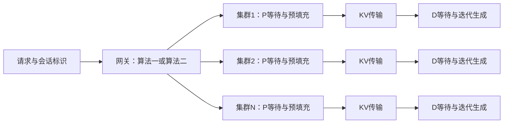
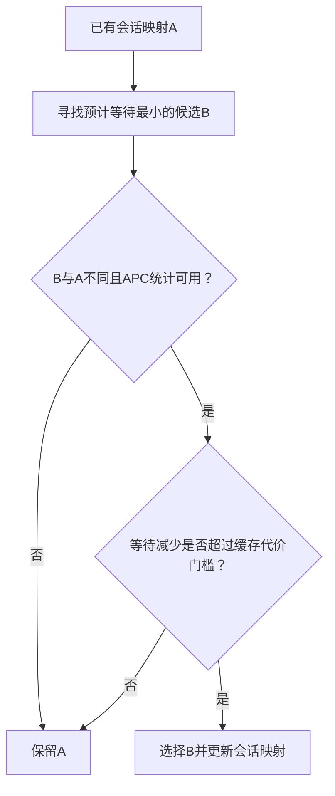
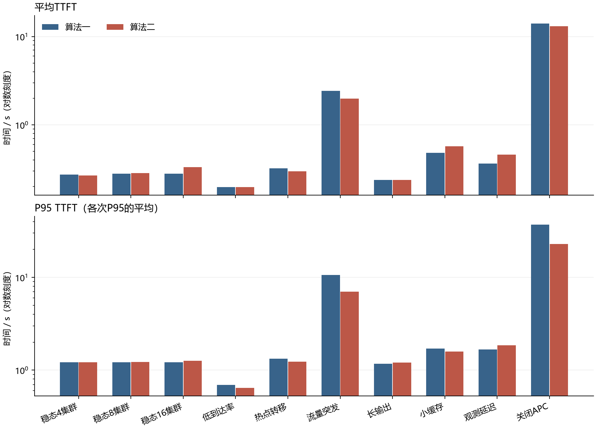
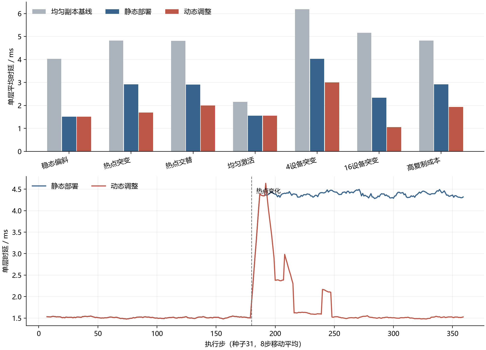

# 算法、测试场景与博士后研究报告总结

本文配套陶壮的博士后研究报告《大模型基础设施关键技术研究与工程实践》，依据2026年9月20日修订版整理。先介绍研究问题和主要结论，再解释本仓库实际运行的算法、测试场景及结果。想直接运行代码，可以先看[README](../README.md)；需要全部建模参数，可以看[MODEL.md](MODEL.md)。

本仓库完成了两类模拟：**多套1P1D服务后端之间的请求路由**，以及**MoE层内的专家副本部署与动态调整**。前者评价请求的首token时延，后者评价单层服务时延。所有参考结果来自合成输入和明确给定的时间模型，不需要启动vLLM或加载模型权重。

## 1. 博士后研究报告总结

### 1.1 研究的两个问题

大模型推理的负载均衡，至少发生在两个层次。

第一层是模型内部。MoE模型每次只激活一部分专家，专家被选中的频率往往不同。如果热门专家集中在少数设备上，一轮计算就可能被最忙的设备拖住。增加热门专家的副本可以分散工作，但副本要占用设备槽位，放在哪台设备上也会影响结果。因此，需要同时考虑**副本预算、设备容量、同一专家不能在同一设备上重复放置，以及运行中的热点变化**。

第二层是模型服务入口。同一模型可以由多套预填充/解码分离的后端提供服务。网关不仅要选择较空闲的后端，还要考虑请求前缀能否复用。同一会话继续访问原后端，通常更有机会复用缓存；但缓存可能被淘汰，原后端也可能已经拥堵。于是，核心问题变成：**继续等待原后端，还是放弃一部分缓存收益，切换到另一套后端？**

这两个问题共享一个思路：先把工作量、可用资源和调整成本放到同一个目标里比较，再决定是否调整。它们分别对应模型内部的部署决策和模型外部的请求选择，本文分别建模和验证。

### 1.2 主要研究内容

| 研究内容 | 解决的问题 | 报告中的主要结论 |
| --- | --- | --- |
| 专家副本分配 | 有限冗余预算优先给哪些专家 | 在固定工作量、等成本、均匀分担与整数上限条件下，堆式分配取得最大单副本负载子问题的最优值。 |
| 受约束设备放置 | 副本如何组合到设备上 | 单副本负载最优，不代表设备最大负载最优；放置需要另外检查容量、唯一性及组合关系。 |
| 布局改进与动态调整 | 是否值得改变现有布局 | 预算交换按设备目标接受改进；动态更新还要比较热点持续期内的收益和复制、切换成本。 |
| 算法一 | 如何利用会话复用并分散新请求 | 保持已有健康会话映射，新会话采用低负载候选，其他请求按输入形态选择目标。 |
| 算法二 | 何时应打破已有会话绑定 | 比较等待减少与缓存收益损失；进一步分析双端缓存、异构速率和预测误差。 |
| 排队分析 | 为什么平均负载相近，时延仍不同 | 等待不仅取决于平均服务时间，还受服务波动、利用率、缓存状态及分流方式影响。 |

报告的贡献主要在问题建模、约束下的算法组织、适用条件分析和系统落地。堆、贪心放置、最大流、排队公式和凸优化是使用的基础工具。

### 1.3 系统实现与应用结果

研究工作以OmniPlacement专家部署与负载均衡为主线，相关能力经历了在OmniInfer中的集成及Omni-EPLB独立演进。请求路由是服务化部署方面的工程扩展，算法一接入Omni-ELB的LiteLLM服务链路。

报告记录：**算法一在实际运行中，TTFT较原方案降低10%，经内部集群验证并通过验收。**这项工作先在实际服务中落地，线上请求和运行条件会变化，本仓库后来补充固定输入、固定资源的模拟，帮助理解不同场景下的算法行为。算法二在本报告中对应理论分析和模拟结果。

OmniInfer属于团队项目。报告引用的公开组件消融说明，在特定系统配置下，专家均衡可以改善吞吐和持续生成效率，同时也可能增加首次响应等待。这些系统结果按团队与组件层面理解，不能全部归为个人收益，也不能与网关算法一的10%结果相加。本仓库没有重建这些硬件实测点值。

### 1.4 从报告到本仓库

| 报告中的内容 | 仓库中的对应内容 | 本次覆盖范围 |
| --- | --- | --- |
| 第3—4章专家模型与部署算法 | [eplb.py](../src/llm_repro/eplb.py)、[原静态函数](../src/llm_repro/vendor/omni_eplb_static.py) | 单层副本分配、受约束放置、过去窗口驱动的动态更新。 |
| 第5章请求路由 | [routing.py](../src/llm_repro/routing.py) | 算法一、算法二的简化判据，以及轮询、最小等待对照。 |
| 第4—5章数学性质 | [verification脚本](../scripts/verification/) | 小规模精确枚举、排队公式、误差门槛、缓存服务矩和切换阈值核验。 |
| 第6章时延模拟 | [实验入口](../scripts/run_experiments.py)、[参考结果](../results/reference/RESULTS.md) | 120次路由运行、63次EPLB运行及原始记录。 |
| 第7章系统实现与应用结果 | 本文第1.3节摘要 | 说明结果归属；不包含生产业务轨迹或实际部署配置。 |

报告中的跨层资源分配、预算交换、双端缓存与稳健切换扩展，不应自动理解为已加入本仓库的时延对照。数学核验与实际参与模拟的策略分别列在下面。

## 2. 请求路由：测了哪些算法

### 2.1 后端结构与时间目标

共有N套独立后端，每套后端包含一个P实例、一个D实例和一条KV传输链路。P负责预填充，D按迭代批处理生成输出。“一个实例”表示逻辑服务单元，不规定其占用的GPU数量。



本模拟以**第一个D输出token返回**作为TTFT终点。它包含P等待、P计算、KV等待与传输、D准入等待，以及第一轮D执行。若实际部署在P阶段就返回首token，统计边界需要相应改变。

P执行时间按下式计算，单位为秒：

$$
T_P(r,i)=0.008+\frac{n_r-L_{ir}}{3600}+0.000003n_r.
$$

这里，$n_r$是输入token数，$L_{ir}$是请求真正执行时在后端i复用的token数。缓存命中减少重复预填充计算；等待时间由模拟器中的队列和事件顺序产生。完整的KV与D时间模型见[MODEL.md](MODEL.md)。

### 2.2 算法一：会话优先与低负载选择

算法一尽量维持已有会话的缓存复用机会。在本模拟中，所有后端保持健康，具体流程为：

1. 具有会话亲和且已有映射：沿用原后端。
2. 具有会话亲和但还没有映射：按观测负载排序，在最低的k个候选中随机选择，并建立映射。
3. 没有会话亲和：A形态选择最小负载，B形态按稳定散列选择。

候选数为：

$$
k=\max\{1,\lceil0.1N\rceil\}.
$$

因此，4套和8套后端时k为1，16套时k为2。10%是现有算法的候选比例，并非理论推出的最优常数。模拟中的A/B形态用输入长度划分；低负载量采用观测P/D在途计数与网关分配预留，具体口径见MODEL.md。生产网关的接口和计数实现另有工程细节。

算法一容易理解，也能保护缓存；不足是即使原后端明显拥堵，已有会话仍会继续保持。

### 2.3 算法二：为会话保持加一个成本判断

算法二保留算法一的新会话和无亲和分支，只替换“已有会话就一直保持”的分支。设A为原后端，B为预计等待最小的候选，模拟中的切换条件是：

$$
\widehat W_A-\widehat W_B
>
1.2\,\frac{\widehat\theta_A\bar n}{v}.
$$

左侧是预计减少的等待时间；右侧是原端缓存可能节省的预填充时间，再乘以1.2的相对裕度。$\widehat\theta_A$为原端历史token复用比例，$\bar n$为模型组历史平均输入长度，v为模型设定的有效预填充速率。两侧都以秒计。



等号时保持原后端；APC统计缺失时也保持。切换发生在本次请求转发前，不搬迁已经执行中的请求，也不自动复制原后端的缓存。

报告先给出了更一般的两动作比较。若两端复用比例为$\theta_A,\theta_B$，有效速率为$v_A,v_B$，另有未计入预测的切换成本$\kappa_{AB}$，则在其他阶段代价可相消时：

$$
W_A-W_B>
 n\left(\frac{1-\theta_B}{v_B}-\frac{1-\theta_A}{v_A}\right)+\kappa_{AB}.
$$

本仓库时延对照执行的是前面的**简化判据**：决策没有读取B的真实缓存，用历史平均输入代替逐请求输入。B上的实际命中仍由模拟器计算。因此，我们既能观察切换减少等待，也能观察它因为丢失缓存或状态滞后而变慢。1.2的裕度本身不构成预测误差保证。

### 2.4 APC命中如何参与模拟

每个P实例都有独立、有限容量的LRU前缀缓存。缓存块大小32token，默认8192块。请求进入P执行时查找最长连续命中前缀，P完成后才写入缓存。

所以，“同一会话访问同一集群”只是复用的前提。原缓存可能已经淘汰，切换后的后端也可能已有公共前缀。执行时的实际命中与决策时的历史命中估计是两件事：后者按最近120个已完成P请求统计，状态每0.25秒发布一次。

算法只读取当时已发布的状态，不能提前看到未来请求或输出的真实剩余长度。

### 2.5 对照策略

| 策略名 | 目标选择 | 在对照中的作用 |
| --- | --- | --- |
| `round_robin` | 每个请求轮流选择后端 | 观察不主动保持会话、不读取等待状态时的表现。 |
| `least_wait` | 每个请求选择预计等待最小的后端 | 观察只追求较小等待、不设置缓存代价门槛的表现。 |
| `algorithm_one` | 保持会话，新会话进入低负载候选 | 作为具有会话亲和的基准。 |
| `algorithm_two` | 在算法一上增加已有会话的成本判断 | 观察主动保留或切换的收益及代价。 |

### 2.6 为什么报告还讲M/G/1

N套后端不是一个服务台。报告中的平稳参考模型是N条并行队列，**每个后端在特定假设下分别抽象为M/G/1**。如果多个服务台共用一个队列，就需要另一类模型；P/D分离和连续批处理也不能严格等同于单服务台。

M/G/1的作用是解释服务均值、波动和利用率如何影响等待。在泊松到达、独立服务、先到先服务等条件下：

$$
\rho_i=\lambda_i\mathbb E[S_i]<1,
\qquad
\mathbb E[W_i]=\frac{\lambda_i\mathbb E[S_i^2]}{2(1-\rho_i)}.
$$

缓存改变服务时间，也可能改变服务时间的波动。只知道一个平均命中比例，并不总能确定排队时间。本仓库的时延模拟直接推进P、KV和D事件；M/G/1公式通过另一组数学脚本核验，不拿它替代所有后端的运行过程。

## 3. 请求路由的10个场景

每次运行生成1800条请求、160个会话，90%请求具有会话亲和。基础输入长度从512、1024、2048、4096中抽取，再加入会话历史和新输入；普通输出长度从64、96、128、160中抽取。场景使用种子31、47、89，各算法共享相同请求轨迹。

| 场景ID | 后端数 | 到达率/请求每秒 | 主要变化 | 观察的问题 |
| --- | ---: | ---: | --- | --- |
| `steady_4` | 4 | 7 | 稳定会话偏斜 | 较小集群下，保持与切换的差别。 |
| `steady_8` | 8 | 14 | 稳定会话偏斜 | 默认规模下的基本对照。 |
| `steady_16` | 16 | 28 | 扩大后端数，候选数变为2 | 规模和候选集合如何改变分流与复用。 |
| `light_8` | 8 | 4 | 降低到达率 | 等待压力较小时，切换是否还有意义。 |
| `hot_shift_8` | 8 | 14 | 请求轨迹40%处会话热点平移 | 原绑定能否适应热点变化。 |
| `burst_8` | 8 | 基准14 | 包含热点变化，中间30%请求的到达率提高到2.8倍 | 突发积压下，主动切换能减少多少等待。 |
| `decode_heavy_8` | 8 | 6 | 输出长度扩大4倍 | D侧压力对路由与首token的影响。 |
| `small_cache_8` | 8 | 14 | APC容量从8192块缩到1024块 | 缓存更易淘汰时，切换是否仍划算。 |
| `stale_8` | 8 | 14 | 状态观测延迟2秒 | 使用旧状态会造成怎样的误判。 |
| `no_apc_8` | 8 | 14 | 禁用APC | 失去复用后，服务压力和队列如何变化。 |

这是开环前缀访问轨迹：后续请求事先生成，不等待上一轮真实生成内容再构造输入。前20%到达请求用于预热，但仍完整执行；后1440条用于时延统计。所有请求完成后再汇总。

每个种子分别计算均值和nearest-rank P95，再对三个种子的相应指标取算术平均。因此，下表的P95是“各次P95的平均”，不是混合所有样本后的P95。关闭APC时输入工作量可能超过P处理能力，下表仍是有限轨迹及排空结果，不解释成稳态时延。

相对变化为算法二均值除以算法一均值再减1；负值表示算法二更快。

| 场景 | 算法一均值/s | 算法二均值/s | 二相对一 | 算法一P95/s | 算法二P95/s |
| --- | ---: | ---: | ---: | ---: | ---: |
| `steady_4` | 0.2746 | 0.2680 | -2.38% | 1.2143 | 1.2163 |
| `steady_8` | 0.2808 | 0.2837 | +1.03% | 1.2119 | 1.2215 |
| `steady_16` | 0.2807 | 0.3328 | +18.56% | 1.2189 | 1.2573 |
| `light_8` | 0.1981 | 0.1979 | -0.09% | 0.6935 | 0.6425 |
| `hot_shift_8` | 0.3217 | 0.2983 | -7.28% | 1.3271 | 1.2330 |
| `burst_8` | 2.4300 | 1.9850 | -18.31% | 10.6106 | 6.9887 |
| `decode_heavy_8` | 0.2389 | 0.2376 | -0.54% | 1.1715 | 1.2046 |
| `small_cache_8` | 0.4831 | 0.5708 | +18.14% | 1.7112 | 1.5849 |
| `stale_8` | 0.3657 | 0.4614 | +26.15% | 1.6700 | 1.8466 |
| `no_apc_8` | 13.9658 | 13.0630 | -6.46% | 37.1062 | 22.9091 |



算法二在热点转移和流量突发场景中减少了等待，平均TTFT分别下降7.28%和18.31%。但它不是所有场景都更快：小缓存场景平均TTFT增加18.14%，观测延迟场景增加26.15%，稳态16集群也增加18.56%。小缓存场景甚至出现P95下降、均值上升，说明只看一个指标容易漏掉取舍。

这些结果说明，主动切换的效果取决于等待估计、缓存复用以及输入长度估计是否匹配当前请求。它们不能换算为算法一生产环境中的10%收益。

## 4. EPLB：测了哪些算法

### 4.1 从副本数量到设备布局

令$a_e$为专家e的工作量，$r_e$为其副本数，$N_d$为设备数，R为额外副本预算。副本分配首先考虑：

$$
\min_{r}\max_e\frac{a_e}{r_e},
\qquad
1\le r_e\le u_e\le N_d,
\qquad
\sum_e(r_e-1)\le R.
$$

堆式分配每次给当前单副本负载最高、且没有达到上限的专家增加副本。它在报告列明的等成本、均匀分担等条件下解决这个子问题。

得到副本数量后，还要把副本放到设备上。第二阶段按单副本负载降序处理，在仍有槽位、且尚未放置该专家的设备中选择当前累计负载最小者。合法布局的设备负载目标是：

$$
\min_x\max_d\sum_e x_{ed}\frac{a_e}{r_e},
\qquad x_{ed}\in\{0,1\},
\qquad\sum_d x_{ed}=r_e,
\qquad\sum_e x_{ed}\le C_d.
$$

这个目标与第一阶段不同。即使第一阶段已经最优，专家副本之间的组合仍可能使设备不均衡。贪心放置如果走入死路，仓库用最大流寻找合法布局并记录回退次数；最大流在这里保证可行性，不保证负载最优。

两个静态函数直接取自Omni-EPLB源码快照，函数体保留，来源及校验值见[PROVENANCE.json](../src/llm_repro/vendor/PROVENANCE.json)，第三方许可随代码保存。

### 4.2 三种对照方式

| 模式 | 初始布局 | 运行中的变化 |
| --- | --- | --- |
| `uniform` | 不读取热点，轮流分配额外副本，最大流构造确定性可行布局 | 保持布局，不优化放置负载。 |
| `static` | 根据独立80个训练窗口的激活统计，执行副本分配与贪心放置 | 测量窗口内保持布局。 |
| `dynamic` | 从与static相同的布局开始 | 使用过去32步，每16步评估一次是否更新。 |

动态模式只有同时满足以下条件才更新：当前预测最大负载/平均负载大于1.10；候选布局使最大预测负载下降超过3%；按32步估计的时间节省大于新增副本的复制成本。

预测只使用过去记录。门槛体现了“改善够不够大、热点能不能维持、复制值不值得”的考虑。本实现没有加入完整的预测误差上界，因此不直接继承报告中稳健扩展的收益保证。

### 4.3 如何换算时延

每步产生1024次逻辑专家激活，在物理副本间按轮转方式整数分配，检查总激活数守恒。这不是完整模型的top-k门控和算子执行。

单层服务时延为：

$$
T_t=0.08+\frac{\max_d A_{d,t}}{96}
+c_{\mathrm{copy}}\Delta_t
\quad\text{ms}.
$$

$A_{d,t}$为该步落在设备d上的激活数，$\Delta_t$为该步布局更新需要新增复制的副本数。普通场景每份复制0.15ms，高复制成本场景为1.5ms；复制时间同步计入发生更新的步骤，初始权重加载不在测量窗口内。

这里测的是单层服务时延，不能与请求TTFT直接相加，也不能当作整模型或真实设备的加速比例。

## 5. EPLB的7个场景

默认32个专家、8台设备、每台6个槽位。每个场景运行360步，使用三个种子和三种模式，总计63次。偏斜场景使用Zipf指数1.3，多项分布生成每步激活量。

| 场景ID | 专家数/设备数/每台槽位 | 变化 | 观察的问题 |
| --- | --- | --- | --- |
| `steady` | 32 / 8 / 6 | 热点保持稳定 | 静态布局有效时，动态策略能否避免无收益更新。 |
| `shift` | 32 / 8 / 6 | 测试中点发生热点突变 | 布局需要多久适应新热点。 |
| `oscillate` | 32 / 8 / 6 | 热点每12步交替 | 热点变化快于评估周期时的追踪和切换代价。 |
| `uniform` | 32 / 8 / 6 | 训练和测试均为均匀激活概率 | 没有显著专家热点时的布局差异。 |
| `scale_4` | 16 / 4 / 6 | 热点突变 | 较小设备规模下的效果。 |
| `scale_16` | 64 / 16 / 6 | 热点突变 | 较大设备规模下的效果。 |
| `costly_shift` | 32 / 8 / 6 | 热点突变，单位复制成本扩大10倍 | 成本门槛是否减少更新。 |

| 场景 | uniform/ms | static/ms | dynamic/ms | 动态相对静态 | 动态更新次数均值 |
| --- | ---: | ---: | ---: | ---: | ---: |
| `steady` | 4.0242 | 1.5148 | 1.5148 | +0.00% | 0.00 |
| `shift` | 4.8179 | 2.9183 | 1.6913 | -42.05% | 3.00 |
| `oscillate` | 4.8110 | 2.9102 | 1.9989 | -31.32% | 5.67 |
| `uniform` | 2.1593 | 1.5569 | 1.5569 | +0.00% | 0.00 |
| `scale_4` | 6.1907 | 4.0316 | 3.0039 | -25.49% | 2.67 |
| `scale_16` | 5.1625 | 2.3382 | 1.0504 | -55.08% | 2.00 |
| `costly_shift` | 4.8179 | 2.9183 | 1.9377 | -33.60% | 1.00 |



稳态下，动态模式保持静态布局，没有额外切换。热点突变时，动态模式平均时延从静态的2.9183ms降至1.6913ms，下降42.05%。复制成本扩大10倍后，平均更新次数由3次降至1次，体现了更新成本对决策的影响。

均匀激活场景中，static仍比uniform更快。这与两种基线的副本组合和设备放置有关，不能将差异全部解释为发现了专家热点。不同设备规模的收益也同时受基线、预算组合和激活分布影响。

## 6. 如何确认结果可以复现

### 6.1 算法与模拟器检查

| 检查类别 | 核对内容 | 入口 |
| --- | --- | --- |
| 18项单元测试 | 单请求解析时延、阶段先后、LRU淘汰、跨后端缓存隔离、切换门槛、候选数取整、D批容量、放置可行性、守恒及确定性 | [test_models.py](../tests/test_models.py) |
| 副本与放置核验 | 5796个副本子问题与精确枚举比较；两阶段目标差异和贪心失败反例；合法最优负载322/3 | [placement_checks.py](../scripts/verification/placement_checks.py) |
| 排队与误差核验 | 1000组一阶条件、19999个分流网格点、各50000组快照及改派误差检查 | [queue_checks.py](../scripts/verification/queue_checks.py) |
| 缓存服务矩核验 | 命中比例与一阶、二阶服务矩，以及缓存反馈导数 | [cache_checks.py](../scripts/verification/cache_checks.py) |
| 会话切换核验 | 两端缓存、异构速率、固定成本等边界及5000组阈值检查 | [session_switch_checks.py](../scripts/verification/session_switch_checks.py) |
| 原始记录复算 | 时间戳因果关系、TTFT分解、均值、P95、命中比例、迁移成本、激活守恒、公共轨迹及计算脚本哈希 | [audit_results.py](../scripts/audit_results.py) |

以上检查已通过。有限枚举与数值检查用于核对实现和发现反例，一般数学结论仍依赖报告中的假设与证明。另已把项目复制到不同目录运行一个完整场景，确认轨迹与结果一致，见[VERIFICATION.md](../VERIFICATION.md)。

### 6.2 重新运行

在仓库根目录执行，建议Python 3.11及以上；参考运行使用Python 3.12.14、NumPy 2.3.5。

```bash
python -m pip install -r requirements-lock.txt
python -m unittest discover -s tests -v
python scripts/run_experiments.py --out results/local/full
python scripts/audit_results.py --results results/local/full
python scripts/summarize_results.py --results results/local/full
```

想先检查环境，可以在实验命令中增加`--quick`，并改用`results/local/quick`目录。快速模式减少请求、步骤、场景和种子，不能复现本文完整表格。需要重新绘图，可安装`python -m pip install ".[plots]"`，再给汇总命令增加`--plots`。

### 6.3 从结论找到原始记录

- 汇总入口：[RESULTS.md](../results/reference/RESULTS.md)。
- 路由配置：[routing_configs.json](../results/reference/routing_configs.json)；逐请求时间戳与缓存记录：[routing_requests](../results/reference/routing_requests/)。
- EPLB配置：[eplb_configs.json](../results/reference/eplb_configs.json)；逐步负载与复制成本：[eplb_steps](../results/reference/eplb_steps/)。
- 三种子汇总：[routing_aggregate.csv](../results/reference/routing_aggregate.csv)、[eplb_aggregate.csv](../results/reference/eplb_aggregate.csv)。
- 运行环境与计算源码版本：[run_manifest.json](../results/reference/run_manifest.json)；独立复算结果：[audit.json](../results/reference/audit.json)。
- 仓库文件校验：[MANIFEST.sha256](../MANIFEST.sha256)。`.gitattributes`保留原始换行字节，避免检出时改写归档校验值。

## 7. 后续可以沿着哪些方向继续做

请求路由方面，可以把候选后端的缓存也纳入决策，用请求级输入估计替代组平均，再比较额外观测成本是否值得。另一条方向是利用真实运行轨迹校准P、KV和D阶段的时间模型，检查长输出、状态滞后和不同缓存容量下的表现。

EPLB方面，可以把通信、设备异构和权重大小加入成本模型，研究跨层预算与异步更新，并用精确小规模解或可验证下界评价布局质量。动态调整仍应同时看布局改善和更新代价，避免为了追逐短暂热点频繁迁移。

本报告与这组模拟共同关心的，是调度决策在什么条件下值得做：专家增加副本后能否放得更好，会话离开原后端后能否更早得到响应，以及这次改变要付出多少成本。
