# 技术报告

## 大模型基础设施工程实践：OmniPlacement / Omni-EPLB、DataInfra / DataHub 与 Omni-ELB / LiteLLM

**作者：陶壮**  
**版本：2026-09-22（工程技术版）**  
**用途：博士后出站答辩补充材料、项目技术评审与工作量说明**

> 本报告以工程实现为主、理论说明为辅。正文分别介绍三个项目域，不把它们包装成一个未经证实的统一系统：OmniPlacement / Omni-EPLB 负责 MoE 模型内部的专家放置与运行时负载均衡；DataInfra / DataHub 负责数据资产、元数据、身份权限和自然语言交互；Omni-ELB / LiteLLM 负责模型服务入口的请求路由、状态刷新和可观测性。  
> 报告区分“项目整体能力”“本人直接负责或可由提交记录证明的工作”“团队或系统级结果”。内部地址、凭据、员工编号、真实部署拓扑和未公开业务规模不写入报告。

---

## 摘要

本报告总结本人在博士后工作期间围绕大模型基础设施开展的工程研发，重点说明项目为什么需要建设、系统如何分层、关键模块如何协作、核心代码如何工作、工程问题如何定位和闭环，以及本人在其中承担的具体设计与实现工作。报告不以公式推导为主，而以“场景与约束—模块边界—数据与控制流—关键代码—测试与交付—工作量证据”的顺序展开。

第一条主线是 OmniPlacement / Omni-EPLB。MoE 模型在推理时只激活部分专家，但专家激活并不均匀，热点专家容易集中到少数设备，形成同步关键路径。该项目从激活采集、逻辑专家工作量还原、冗余副本分配、受约束设备放置、Pattern 生成，到运行时监测、候选布局生成、权重批量迁移和映射切换，形成了离线与在线两套工程闭环。核心实现横跨 Python 编排、C++ 优化器、HCCL 通信、NPU 内存、配置与多模型适配、单元测试和可视化工具。本人在开源前内部研发和后续公开仓演进中持续参与，从 C++ `placement_optimizer` 原型、冗余与交换算法、收益门禁、Pattern 工具链，到批量发送、动态静态策略、UT 流水线、多模型/共享专家/零专家适配和独立 SDK 演进，承担了连续的算法工程化工作。

第二条主线是 DataInfra / DataHub。项目目标不是单点修改 DataHub，而是围绕数据资产登记、身份认证、权限治理、元数据注册、运行时上报和自然语言交互构建企业数据平台能力。本人完成或主导了华为 IDaaS SSO 接入、工号与部门访问控制、运行时授权管理、`datahub_extensions` 分层重构、统一 API 网关、注册 SDK、全局/数据域两种权限模式、Publisher 角色、永久 Token 自动发放与无感鉴权，以及 Data Agent 对话 SDK 和八类元数据工具。工程范围覆盖 Java/Spring、Play、GraphQL、React/TypeScript、Python/FastAPI、DataHub Entity/Aspect/MCP、Kafka/REST Emitter、Kubernetes 配置、测试和文档。

第三条主线是 Omni-ELB / LiteLLM。该项目位于模型服务入口，面向多套 P/D 分离后端完成健康候选过滤后的集群选择。当前策略优先保持 `user_id` 会话亲和；新会话在有负载观测时从低负载 10% 候选中随机选择；无观测时退化为确定性哈希；Pipeline Key 则交回 LiteLLM 默认策略。本人和同事共同承担当前路由架构，本人直接完成两个关键可靠性改造：一是把 Redis 负载刷新从人工正则配置改为通过 `/model/info` 自动发现部署并与 Prometheus 集群标签精确连接，补充漏刷诊断和降级路径；二是修复 Pipeline Key 日志过滤链路重复触发 Prometheus 成功回调所造成的指标翻倍。两项工作提交规模不大，但分别作用于调度输入的正确性和容量判断的可信性。

从工程方法看，三条工作共享一套实践：用稳定标识连接控制面与执行面；将高频数据通路和低频管理通路分开；在切换前验证约束，在切换后验证状态；用灰度开关和降级路径控制风险；用测试、诊断信息和证据台账保证可复核性。报告最后给出个人工作量口径、关键 PR/MR 与提交清单、模块—文件映射、复现与验收清单，以及尚需补证或继续改进的边界。

**关键词：** MoE；专家负载均衡；OmniPlacement；Omni-EPLB；DataInfra；DataHub；元数据；权限治理；Data Agent；Omni-ELB；LiteLLM；会话亲和；可观测性

---

## 1. 报告定位、范围与证据原则

### 1.1 为什么需要一份独立的工程技术报告

研究报告回答的是“问题如何抽象、算法在什么条件下成立、实验支持什么结论”。工程技术报告回答的是另一组同样重要的问题：

1. 项目在真实系统中位于什么位置，解决哪个运行环节的问题；
2. 一个算法如何被拆成可编译、可配置、可观测、可测试、可回滚的模块；
3. 数据从哪里来，经过哪些校验，如何变成决策，决策如何安全地作用于运行系统；
4. 本人具体做了哪些设计、代码、联调、测试、缺陷修复和文档工作；
5. 哪些结果属于项目团队，哪些可以落到本人直接贡献，哪些仍然只是方案或待验证项。

因此，本报告不重复研究报告的大段理论证明，而是把理论对象映射到工程对象。例如，“专家工作量”在代码中对应激活计数张量、AllGather 后的集群统计和滑动窗口；“布局”对应三维 Pattern、`PlacementMapping` 和 selector；“切换成本”对应权重传输、批次握手、缓冲区复制和映射生效；“路由负载”对应 Redis 中的 `{model_group}:{deployment_id}:inflight`；“用户身份”对应 SSO 回调、CorpUser、用户 PAT 与服务级 Token。

### 1.2 三个项目域的边界

| 项目域 | 主要决策对象 | 所处层次 | 典型输入 | 典型输出 |
|---|---|---|---|---|
| OmniPlacement / Omni-EPLB | 专家副本数、物理位置、映射更新 | 单个 MoE 推理系统内部 | 专家激活、当前 Pattern、设备/槽位约束 | 新 Pattern、ADD/REMOVE 指令、更新后的 selector |
| DataInfra / DataHub | 数据资产、元数据、身份、权限与操作接口 | 企业数据平台控制面与元数据面 | 注册 YAML、用户身份、Domain、运行事件、自然语言请求 | Entity/Aspect/MCP、权限判定、资产查询与 Agent 回答 |
| Omni-ELB / LiteLLM | 请求属于哪一套健康模型集群 | 多集群服务入口 | `user_id`、Key 类型、健康候选、P 侧负载 | 一个目标部署，或交回 LiteLLM 默认调度 |

三者都涉及“分配”和“负载”，但决策粒度不同。专家放置不能替代请求路由；请求路由也不能改变某个集群内部专家权重的位置。DataInfra 是数据与治理平台，不应为了叙事方便被硬连成推理链路的一个组件。本报告只在“工程方法”层总结共性，不声称三者已经组成一套端到端产品架构。

### 1.3 个人贡献与项目能力的表达规则

本报告使用以下三种标记：

- **项目整体：** 仓库或系统当前具备的能力，可能由多人共同建设。
- **本人工作：** 有本人署名提交、本人发起 MR/PR、设计文档、历史活动或用户确认支撑的工作。
- **边界说明：** 无法仅凭当前证据归到个人，或尚未完成生产验证的部分。

例如，OmniInfer 论文的公开组件消融是团队系统结果；本人可以说明自己负责了 OmniPlacement 的若干模块，但不能把整个系统的吞吐率提升写成个人独立结果。DataInfra 的总体架构文档描述项目全貌，不等于本人独立完成所有服务。Omni-ELB 中 Autoscaler 和未来统一请求池可以作为项目背景或后续方向，不能写成已经由本人交付。

### 1.4 证据来源和统计口径

报告主要依据以下本地证据：

- 最终博士后研究报告及其系统实现章节；
- `相关项目/omniinfer`、`相关项目/omni-eplb`、`相关项目/data_infra_platform`、`相关项目/omni-elb` 当前本地 Git 历史；
- `历史记录.txt` 中开源前内部研发活动；
- PR/MR 逐项核对台账；
- 各项目 README、设计说明、部署说明、测试目录和关键源文件；
- Omni-ELB 的 SEG 技术评审材料与调度算法报告。

代码量使用“指定提交相对其父提交的累计文本增删行”或“去重后的补丁累计值”，用于说明改动范围，不等于净新增代码、当前总代码、独立原创代码或有效产出。大规模重构同时包含删除和迁移，不能只看新增行。当前目录的源文件与测试行数只用于展示系统规模，不能自动归入个人工作量。

---

## 2. 工程工作全景与阶段演进

### 2.1 从算法原型到多项目基础设施

本人博士后期间的工程工作不是同时启动三个项目，而是沿着“高性能推理—平台化治理—服务入口可靠性”逐步扩展：

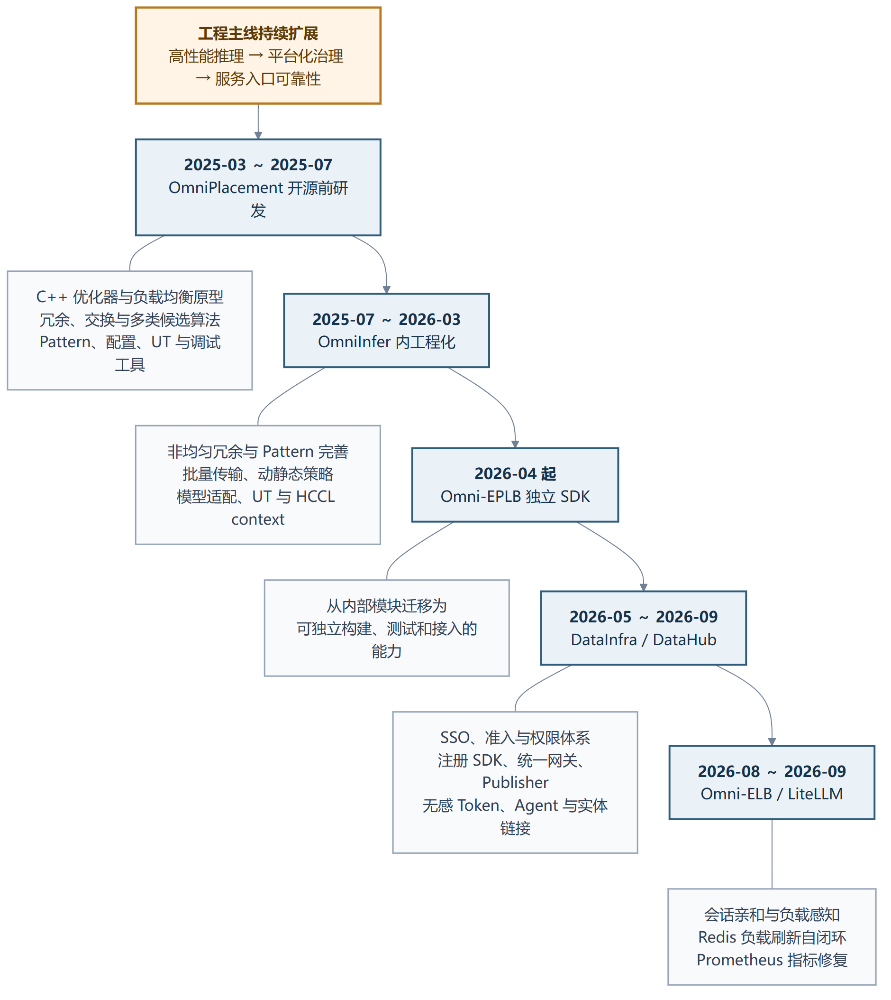

*图 2-1　从算法原型到多项目基础设施的阶段演进。图中时间表示对应工程工作的主要发生区间，项目之间存在重叠，但不是同时起步。*

### 2.2 工程工作类型分解

| 工作类型 | OmniPlacement / Omni-EPLB | DataInfra / DataHub | Omni-ELB / LiteLLM |
|---|---|---|---|
| 算法与策略 | 副本分配、放置、动态候选、收益门禁 | 权限模式、Domain 判定、查询路径选择 | 会话亲和、低负载候选、哈希降级 |
| 核心实现 | Python + C++ + HCCL + NPU 内存 | Java + Python + TypeScript + GraphQL | Python Router + Redis + Prometheus |
| 平台集成 | vLLM/SGLang/OmniInfer、模型适配 | DataHub GMS/Play/React、Kafka、K8s | LiteLLM、NGINX、模型后端、Redis |
| 可靠性 | 约束校验、批次握手、映射切换 | fail-closed、双 Token、并发锁、灰度 | 漏刷诊断、API 降级、指标去重 |
| 测试与工具 | C++/Python UT、Pattern 检查与可视化 | 单元/集成测试、模板与部署文档 | 模拟后端、压力脚本、路由测试 |
| 交付物 | SDK、Pattern 工具、技术报告 | 平台功能、SDK、网关、Agent | 路由模块与刷新脚本 |

### 2.3 解决问题的共同方式

三个项目虽然业务不同，但本人采用的工程方法高度一致：

1. **先定义稳定标识。** OmniPlacement 用逻辑专家 ID、物理槽位和 rank 建立映射；DataInfra 用 URN 连接实体、Aspect 和权限对象；LiteLLM 用 model group、deployment ID 和 user ID 连接健康候选、负载和会话。
2. **把观测与执行解耦。** 激活采集与权重迁移分离，元数据查询与高频事件写入分离，Prometheus 负载采集与实时路由分离。
3. **把纯计算与 I/O 分离。** Pattern/URN/MCP/候选选择尽量做成可测的纯计算；网络、存储、HCCL、GMS 和 Redis 放在边界层。
4. **在危险动作前设置门禁。** 布局改善不足不迁移，Domain 不存在不注册，权限不满足不进入写逻辑，模型列表获取失败走显式降级而不是静默漏刷。
5. **保留回滚和兼容路径。** 静态/动态模式并存，global/domain 权限可灰度切换，API 不可达时保留配置降级，旧字段通过迁移逻辑兼容。
6. **让问题可诊断。** 输出布局前后不均衡度、注册 trace ID、登录尝试记录、漏刷近似名称、缺少 user ID 指标和单元测试失败点。

---

# 第一部分　OmniPlacement / Omni-EPLB：MoE 专家放置与运行时均衡

## 3. 项目背景、目标与总体架构

### 3.1 工程问题

MoE 模型对每个 token 只选择少数专家，因此理论 FLOPs 可以低于稠密模型，但实际系统会受到热点专家影响。若大量 token 在同一层集中到少数专家，而这些专家又位于同一设备或同一节点，最繁忙设备决定同步阶段完成时间。只让每台设备放置相同数量的专家并不能解决问题，因为专家的实际激活量不同。

工程上需要同时处理四件事：

- 观测每一层、每个物理专家槽位的真实激活；
- 把物理槽位统计还原为逻辑专家工作量；
- 在容量、覆盖、同卡唯一性和副本上限约束下产生新布局；
- 将新布局安全地变成权重迁移和映射切换，而不破坏正在执行的请求。

### 3.2 两套闭环

**离线闭环**用于负载相对稳定、允许重启或重新加载 Pattern 的场景：

其端到端步骤与运行时闭环一并汇总在图 3-1 中。

**运行时闭环**用于热点会变化且希望在线调整的场景：

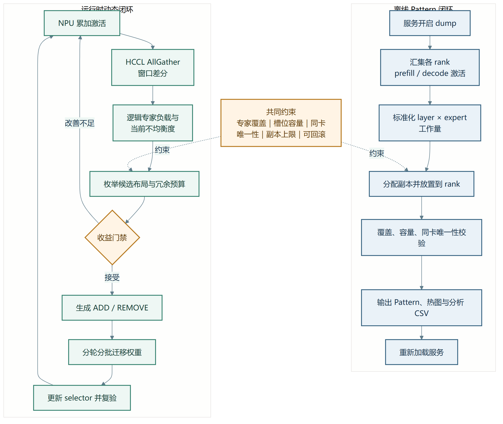

*图 3-1　OmniPlacement / Omni-EPLB 的离线 Pattern 闭环与运行时动态闭环。两条路径共用专家覆盖、槽位容量、同卡唯一性、副本上限和可回滚约束。*

### 3.3 模块分层

| 层次 | 关键模块 | 主要职责 |
|---|---|---|
| 框架接入层 | `omni_planner.py`、`placement_handler.py` | 读取配置、初始化分布式环境、向框架提供 expert mapping 和激活记录接口 |
| 状态与映射层 | `cluster_status.py`、`expert_mapping.py`、`placement_mapping.cpp` | 保存当前 Pattern、逻辑—物理映射、selector 和层更新状态 |
| 激活采集层 | `expert_activation.cpp` | NPU 计数、AllGather、窗口差分、dump、逻辑专家聚合 |
| 优化层 | `expert_load_balancer.cpp`、`placement_optimizer.cpp`、`dynamic_eplb_greedy.cpp` | 生成候选布局、计算不均衡度、选择候选、把布局差异转成指令 |
| 权重与通信层 | `moe_weights.cpp`、`distribution.cpp` | 管理专家权重地址、收发缓冲、HCCL send/recv/allgather、本地复制和批次同步 |
| 离线工具层 | `utils/omni_pattern_tool/` | 从日志/文本到 CSV、Pattern、校验、可视化和分析报告 |
| 质量保障层 | `tests/`、`omni_placement/cpp/test/` | Python/C++ 单元测试、硬件条件测试、构建与覆盖率流程 |

### 3.4 Python 与 C++ 的职责划分

Python 层接近模型框架，适合配置解析、张量映射、模型差异适配和工具链；C++ 层接近 NPU/HCCL 和权重内存，适合低开销统计、布局差异计算、通信编排和异步线程。`OmniPlanner` 是上层入口，负责创建 `ClusterActivation` 与 `Placement`，并向推理框架提供：

- `plan()`：将逻辑专家 ID 映射到物理专家位置；
- `record_activation()`：累加每层每个专家位置的 token 数；
- `start_dynamic_optimize_expert_load_balance()`：启动后台均衡线程；
- `place_experts()`：在主路径安全点应用已准备好的更新；
- `placement_pause()/resume()`：控制更新窗口；
- `logical_to_all_physical()`：适配需要逻辑专家到物理位置列表的框架接口。

C++ 的 `Placement` 聚合 `PlacementMapping`、`ClusterActivation`、`PlacementOptimizer`、`MoEWeights` 和 `Distribution`。这种聚合不是简单“把算法写成 C++”，而是把算法决策、设备状态、权重地址和通信状态放进同一个可控生命周期，避免更新了一半的布局被主线程读取。

## 4. 离线 Pattern 工具链

### 4.1 输入数据与口径

离线工具同时支持日志和文本输入。文本模式下，每个 rank 的文件名包含 record step 和 rank ID；每行对应一个 MoE 层，列为该 rank 上各物理专家位置的激活计数。工具首先把多文件、多 rank 的记录整理成 `layer × logical_expert` 的 CSV，并按配置筛选 prefill、decode 和统计步区间。

输入数据最容易出现的错误不是算法错误，而是口径错位：

- 用 prefill 的激活生成 decode Pattern，或反之；
- rank 文件缺失、重复或时间窗口不一致；
- 模型层数、专家数和采集 rank 数与配置不符；
- 将累计计数直接跨窗口比较，没有处理计数器回绕或差分；
- 把物理冗余槽位当成不同逻辑专家，导致热点被稀释。

因此，工具链在处理前校验输入目录、文件名、维度、非负性、整除关系和目标 rank 数。输出文件名携带时间、模式、特殊层数量、层数、rank 数和统计步区间，便于回溯生成条件。

### 4.2 副本数分配

`allocate_expert_deployments_improved()` 的核心是一个最大堆。每个专家至少部署一次；允许冗余时，把“当前单副本压力”最大的专家弹出，为其增加一个副本，然后以新的 `load / replica_count` 重新入堆，直到预算耗尽或达到单专家副本上限。

```text
deploy[e] = 1 for every expert e
heap.push(-(load[e] / deploy[e]), e)

repeat extra_budget times:
    e = heap.pop_max_pressure()
    deploy[e] += 1
    if deploy[e] < upper_bound[e]:
        heap.push(-(load[e] / deploy[e]), e)
```

工程实现支持 `log1p` 负载变换，但必须明确：一旦变换，优化对象就是变换后的工作量。研究报告中关于最大单副本负载的严格结论只适用于固定非负工作量、等副本成本、均匀分担和整数上限等条件；不能把这个子问题的最优性扩展成整个设备放置和端到端时延的全局最优。

### 4.3 副本实例放置

`distribute_experts_to_ranks()` 先将专家 e 的工作量除以副本数，展开成多个专家实例，再按实例负载降序处理。每个实例选择当前负载最小、仍有空槽、且尚未放置同一逻辑专家的 rank。该实现同时维护：

- `device_loads`：每个 rank 已承担的预测负载；
- `placement_matrix[rank, expert]`：同一专家是否已在该 rank；
- `device_expert_counts`：每个 rank 已占用的槽位数。

放置结束后，代码根据每主机 rank 数进行交错重排，使顺序生成的热点实例分散到不同主机。这里体现了从“数值均衡”到“拓扑意识”的工程转换：副本数决定理论上可以怎样分担，物理重排决定这些副本是否仍然堆在同一节点。

当前实现有清晰的可行性检查：总实例数必须能被目标 rank 数整除；每个 rank 的实例数不能超过专家种类数；单专家副本数不能超过 rank 数；每个 rank 不能重复同一专家。若找不到合法位置则显式失败，而不是输出不完整 Pattern。

### 4.4 层选择与预算

工具先在顺序基线布局上计算各层最大设备负载，再选择高负载层。对于 rearrange 模式，高负载层使用负载感知放置，其他层可以保留顺序放置；对于 redundant 模式，高负载层获得额外副本预算。这样做的工程目的，是把有限内存和迁移成本集中在更可能成为瓶颈的层。

层选择仍是启发式外层决策。绝对最大负载、max/avg 不均衡度、实测层耗时和通信代价可能给出不同的层排序。报告把它描述为可配置的工程策略，不声称已经解决跨层预算的全局最优问题。

### 4.5 输出校验与可视化

Pattern 是形如 `rank × layer × expert` 的三维 0/1 数组。生成后，Step 3 检查每层每个逻辑专家至少出现一次、每层每个 rank 的槽位数一致，并输出两个视图：

- 沿 rank 求和：查看各层每个专家有多少副本；
- 沿 expert 求和：查看各层每个 rank 使用了多少槽位。

Step 4 把激活工作量投影到 Baseline 和多个候选 Pattern 上，输出设备负载热图、各层最大负载柱状图和 CSV。该阶段是部署前的静态代理验证，不替代真实模型的 TTFT、TPOT、E2E 和吞吐测试。

## 5. 运行时动态均衡闭环

### 5.1 激活采集

推理框架在路由完成后调用 `record_activation()`，把当前层每个物理专家位置的 token 数累加到 NPU 张量。计数以大整数上限循环，避免无限增长。后台线程通过 `ClusterActivation.collect()` 完成三步：

1. 把本 rank 计数复制到 Host；
2. 使用 HCCL AllGather 汇集全部 rank 的计数；
3. 用当前累计值减去上一窗口值，得到本窗口增量，并处理计数器回绕。

`updateShiftWindows()` 再按当前 `PlacementMapping` 将物理槽位增量合并到逻辑专家。这一步非常关键：某个热点专家可能有多个副本，若不先按映射聚合，就会把一个逻辑热点误判成多个中等负载专家。

### 5.2 候选生成和收益门禁

`ExpertLoadBalancer` 对每层执行以下逻辑：

```text
current_ratio = imbalance(current_placement, observed_activations)
if current_ratio < input_ratio_threshold:
    keep current placement

for budget in 0, world_size, 2*world_size, ...:
    candidate = generate_layer_placement(budget)
    if candidate is feasible:
        ratio = simulate(candidate, logical_expert_loads)
        save(candidate, ratio)

best = candidate with minimum ratio
if best.ratio < current_ratio - improvement_threshold:
    accept best
else:
    keep current placement
```

预算以 `world_size` 为步长，是因为固定槽位部署要求新增实例可以在所有 rank 间形成一致容量。`input_ratio_threshold` 防止系统在已经较均衡时频繁调整，`improvement_threshold` 防止小幅代理收益触发昂贵迁移。代码还对极端 max/min 比例输出告警，但告警本身不直接等于迁移决策。

这套门禁解决的是“布局指标是否值得改善”，还没有完整把热点持续时间、迁移时间和预测误差统一成时间收益。研究报告进一步给出动态净收益条件；工程上要真正使用该条件，需要在线估计不可重叠的权重更新成本和热点持续窗口。

### 5.3 从目标布局到变更指令

`PlacementOptimizer` 比较当前布局 f 和目标布局 g，为每层生成 `ChangeInstruction`。指令包含层、操作类型、源/目标 rank、源/目标专家、全局位置、优先级、轮次和批次。操作类型保留 `SWAP/ADD/REMOVE/EMPTY`，当前执行校验主要接受 ADD 和 REMOVE：

- ADD：从已有专家位置取得权重，把专家添加到目标空槽；
- REMOVE：从目标布局不再使用的槽位移除专家映射；
- 一个逻辑替换可以被拆成先准备目标权重、再更新映射的安全序列。

优化器为每层打印指令数、调整前和模拟调整后的不均衡度。这些摘要既是调试信息，也是线上问题回溯时判断“为什么发生这次迁移”的依据。

### 5.4 轮次合并与批次拆分

直接逐条执行迁移会串行化通信并放大停顿。`Placement::merge_instructions()` 分析每层使用的目标 rank，把不存在 rank 冲突的层合并到同一轮；`reorder_instructions()` 再把同一轮指令拆成批次，限制一个 rank 在同一批次中只参与一次源或目标传输。

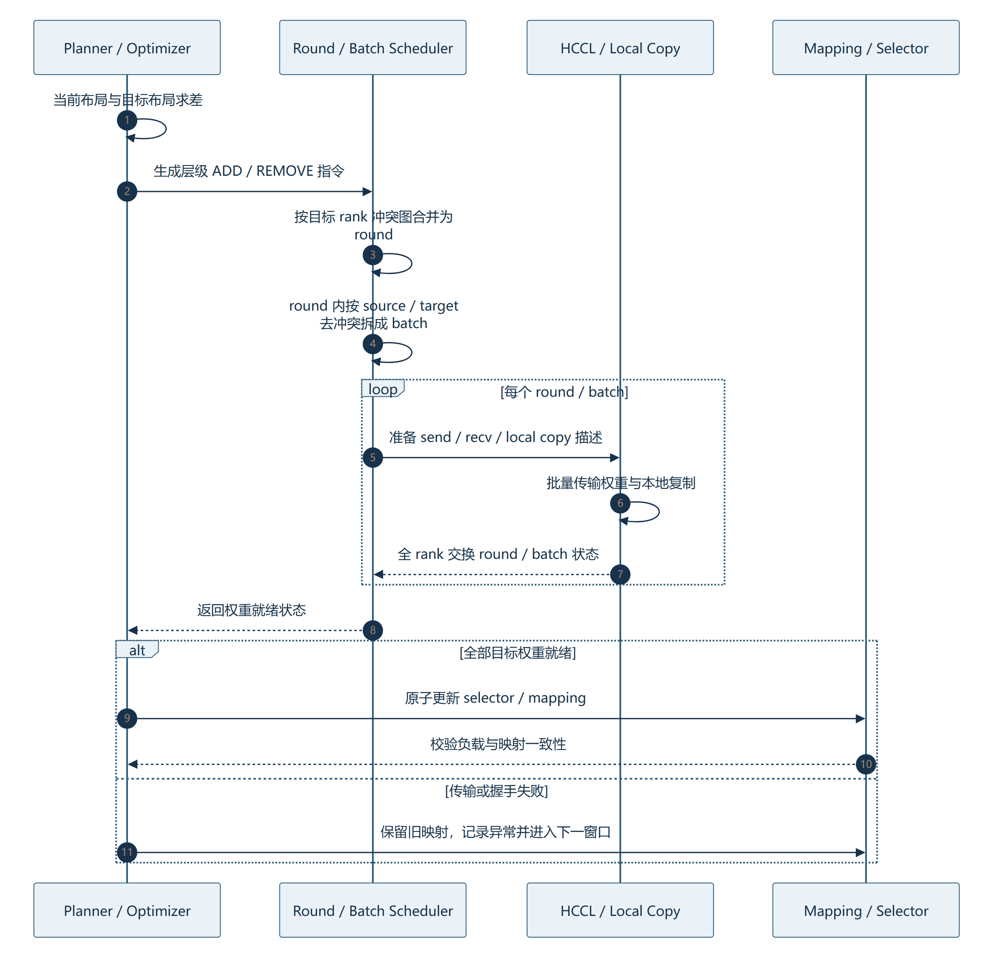

*图 5-1　运行时布局从差异指令到安全生效的执行时序。权重全部就绪后才更新 selector；失败时保留旧映射。*

这不是纯算法优化，而是通信可执行性的约束：如果一个 rank 在同一批次既作为多个源又作为多个目标，缓冲区、流和同步关系会复杂化。按批次限制冲突，以更多小批换取确定性和可诊断性。

### 5.5 HCCL 权重传输和本地复制

`Distribution` 为每个传输描述准备地址、长度、数据类型、目标 rank 和接收缓冲：

- 源与目标是不同 rank：调用 HCCL Send/Recv；
- 源与目标在同一 rank：调用 NPU device-to-device 异步拷贝；
- 接收先写入独立缓冲区，主线程到安全点后再复制到最终 HBM 位置；
- 每个批次后同步 stream，并用 AllGather 校验全 rank 的 round/batch 状态。

本人参与的批量发送工作把多个权重条目组织成统一批次，减少重复准备与同步。后续新增 `enable_new_context`，允许 EPLB 后台线程创建独立 HCCL/ACL context，降低与主推理 context 生命周期耦合。独立仓中的相关 PR 是原 OmniInfer 能力的延续，工作量统计不重复计算同源补丁。

### 5.6 映射生效时机

后台线程完成接收后，只把缓冲就绪标志置为真。主线程在可控调用点执行 `do_placement_optimizer()`：

1. 从接收队列把权重复制到最终 HBM 槽位；
2. 仅对发生变化的层更新 selector；
3. 清理层更新标志和 ready flag。

这保证 selector 不会提前指向尚未装载权重的位置。映射、权重和激活统计三者必须按版本理解；布局生效后，旧窗口的槽位统计不能继续按新映射解释，因此后台会重新采集并清空旧的增量语义。

### 5.7 线程、暂停与异常处理

`Placement` 使用初始化线程等待权重 HBM 准备，再启动 worker；worker 可暂停、恢复和停止。后台循环执行采集、dump、候选生成、指令执行和重新采集。异常在循环内部捕获，使一次统计或更新失败不直接杀死推理主进程。

当前代码中采集间隔变量设为 60 秒，但旁边注释仍写“6 mins”；部分函数注释与实际参数也存在类似陈旧文字。此类“代码与注释漂移”不会立即改变运行结果，却会误导运维和后续开发，建议纳入文档一致性检查。

## 6. 框架接入、模型适配与配置

### 6.1 Pattern 加载与基础校验

`ExpertMapping` 负责从 `.npy` 文件加载 Pattern，验证维度与 world size，并生成：

- 当前 rank 拥有的专家及本地位置；
- 每层每个逻辑专家的物理副本列表；
- 每层是否启用冗余；
- 每个 rank 的最大物理专家槽位数；
- selector 张量和工作映射。

配置同时控制 `enable_dump`、`enable_dynamic`、`pattern_path`、`max_redundant_per_expert`、`max_redundant_per_rank`、`enable_rank_round_robin`、`enable_zero_expert`、`enable_new_context` 等。配置错误尽量在服务启动时暴露，而不是在请求执行中晚失败。

### 6.2 token 到物理专家的映射

普通模型中，`plan_normal_experts()` 根据 selector 将门控输出的逻辑专家 ID 转为物理专家位置。若启用 round-robin，使用 embedding 直接取得目标；否则根据连续 offset 在该逻辑专家的多个副本间轮转。这样既保持模型门控选择不变，又把同一逻辑专家的 token 分摊到多个物理副本。

LongCat 等存在 zero expert 或特殊专家编号的模型不能把全部 ID 直接映射。`plan_with_zero_experts()` 先构造正常专家范围的 mask，只替换有效路由专家，特殊 ID 原样保留。这类适配看似只增加一个条件，但若遗漏，会把模型语义错误地映射到普通专家槽位。

### 6.3 共享专家与多模型适配

现存 PR 记录显示本人参与了 EP144/共享专家场景、非均匀冗余层、LongCat zero expert、新配置模板和 vLLM 适配修复。多模型支持不能只看 README 名称，必须同时检查模型层索引、前置稠密层数量、共享专家 rank、每层专家数、并行 world size 和 Pattern 维度是否一致。

### 6.4 静态与动态模式

| 模式 | 适用场景 | 主要路径 | 风险 |
|---|---|---|---|
| 仅 dump | 采集代表性负载 | 激活采集 → 文件 | 采集窗口不代表未来负载 |
| 静态 rearrange | 设备数较少或内存不允许额外副本 | 离线重排 → 重启加载 | 热点漂移后失效 |
| 静态 redundant | 允许额外专家实例 | 离线副本+放置 → 重启加载 | 额外内存与通信成本 |
| 动态 rearrange | 热点变化，需要在线调整位置 | 运行时统计 → 迁移 → selector 更新 | 更新抖动、迁移成本 |
| 动态 redundant | 同时调整副本和位置 | 在线候选预算 → ADD/REMOVE | 内存、缓冲与一致性最复杂 |

## 7. 测试、诊断与性能验证

### 7.1 测试资产

当前独立 Omni-EPLB 快照中，核心与 Pattern 工具目录约有 52 个 Python/C++/头文件、约 1.72 万行；测试与测试脚本约 26 个文件、约 0.94 万行，检索到约 363 个 Python/C++ 测试入口。该数字是当前仓库规模，不是个人代码量。

测试覆盖的对象包括：

- Pattern 维度、覆盖、每卡槽位与同卡唯一性；
- 专家计数、冗余上限、设备集合和空槽查找；
- 负载计算、副本预算、候选放置和改善门禁；
- 激活累加、差分和回绕；
- 指令生成、排序、合法性和映射等价性；
- HCCL 分布接口、缓冲区和本地复制；
- Python Planner、模型适配、配置加载和工具流水线。

构建脚本会检查 CMake、编译工具、Python、pytest、CANN/torch-npu 环境；测试脚本根据是否存在 NPU 条件执行相应硬件测试，并生成 Python 覆盖率报告。

### 7.2 应重点验证的工程不变量

1. 每层每个逻辑专家至少存在一个实例；
2. 同一 rank 不重复放置同一逻辑专家；
3. 每 rank 槽位不超容量，Pattern 与 world size 匹配；
4. ADD 的源位置确实包含目标专家，REMOVE 的目标位置与当前映射一致；
5. 权重未就绪前 selector 不切换；
6. 全 rank 对 round/batch 的理解一致；
7. 布局切换后统计窗口重新建立，不能混用旧槽位语义；
8. 失败候选和收益不足候选不改变当前布局。

### 7.3 团队级系统结果及边界

OmniInfer 论文公开的组件消融在特定 DeepSeek-R1 INT8、Ascend 910C 和 P/D 配置下，对比“无 OmniPlacement”和“有 OmniPlacement”：

| 指标 | 无 OmniPlacement | 有 OmniPlacement | 相对变化 |
|---|---:|---:|---:|
| 请求吞吐率（归一化） | 1.000 | 1.330 | +33.0% |
| TPOT | 65 ms | 48 ms | -26.2% |
| p99 TPOT | 68 ms | 50 ms | -26.5% |
| TTFT | 1.342 s | 2.292 s | +70.8% |
| p99 TTFT | 2.419 s | 4.198 s | +73.5% |
| E2E | 78.025 s | 59.206 s | -24.1% |
| 输出 token 吞吐 | 45,372 tok/s | 60,575 tok/s | +33.5% |
| 总 token 吞吐 | 169,083 tok/s | 225,546 tok/s | +33.4% |

这是团队系统级结果，说明 OmniPlacement 在该组合中改善了持续生成和吞吐，同时付出了首 token 等待代价。数据没有单独分离本人负责的每个算法、层间冗余、动态更新或通信优化的边际贡献，也没有公开完整重复分布，因此不能把表中增益直接写成本人独立成果。

### 7.4 性能复现建议

复现时应固定模型权重、量化、请求样本、到达方式、P/D 拓扑、并行配置、资源预算和软件版本；分别记录：

- QPS/QPM、输入/输出/总 token 吞吐；
- TTFT、TPOT、E2E 的均值与分位数；
- 每层/每 rank 激活与预测负载；
- 采集、候选生成、指令准备、通信、最终复制和 selector 切换耗时；
- 动态更新次数、失败候选数、收益门禁拒绝数；
- 通信字节量和跨主机比例。

## 8. 本人在 OmniPlacement / Omni-EPLB 中的工作

### 8.1 开源前研发基础

历史活动覆盖 2025 年 3 月至 7 月，能证明本人从原型期参与，而不是只在开源后修改工具。主要工作包括：

- 实现和迭代 C++ `placement_optimizer.cpp/.h`，处理参数、rank、热点排序、内存复制和异常；
- 讨论并实现多冗余、热卡/冷卡、不同层冗余、收益检查和静态/动态 Pattern；
- 迭代 swap optimizer、简单权重交换、Hungarian 确定性、greedy/bucket 等候选方法；
- 建立 Pattern pipeline、基础配置、UT、调试开关、算法验证、可视化和文档；
- 与同事共同推进协作算法、128/256 rank 配置、动态冗余和触发接入。

`历史记录.txt` 中可提取 46 项旧内部 `omni_infer` MR 创建记录和 5 项更早的 `omni-expert` 记录，但记录不含完整最终状态。报告只把它们作为研发过程证据，不写成“46 项已合入”。

### 8.2 现存可核验 PR 与代码量

当前 OmniInfer 历史中可核验 13 项与本人关联的 OmniPlacement 合入记录，覆盖 Pattern、EP144/共享专家、非均匀冗余层、批量发送、动态/静态策略、UT、LongCat zero expert、CLI/配置和 HCCL context。限定范围内有 27 个本人署名提交、26 个去重补丁，累计约 `+7,820 / -9,993` 行。两项 Qwen-Next 非 Placement 协作不计入；等价补丁只计一次。

| 代表性 PR | 工程内容 | 作用层次 |
|---|---|---|
| !32 | 完善 Pattern 生成工具 | 离线工具链 |
| !91 | 非均匀冗余层逻辑 | 层间预算/配置 |
| !303 | Batch Send、动态与静态算法 | 运行时优化与通信 |
| !573 | 最新 OmniPlacement UT 流水线 | 质量保障 |
| !805 | LongCat zero expert | 模型适配 |
| !1775 | YAML 更新与缺陷修复 | 配置与运行稳定性 |
| !2032 | 新 HCCL context | 运行时隔离 |

独立 Omni-EPLB !14 延续 !2032 的能力迁移，单列说明，不重复累计同源代码或创新。当前独立仓约 1.7 万行核心代码和 0.9 万行测试资产，体现项目已从算法模块演进为可独立构建、配置、测试和接入的 SDK，但这些总代码不全部归本人。

### 8.3 本人工作的工程价值

本人贡献可归纳为五类：

1. **算法落地：** 把冗余、交换、重排和收益判断转为可执行数据结构与流程；
2. **运行时机制：** 参与动态触发、激活统计、指令与映射更新的工程闭环；
3. **系统实现：** C++/Python、HCCL、批量发送、配置和框架适配；
4. **质量建设：** UT、算法验证、Pattern 检查、可视化、调试和文档；
5. **生态演进：** 从 OmniInfer 内部能力到独立 Omni-EPLB SDK，并适配多模型和不同框架场景。

相关成果还包括 3 项专利申请、1 项技术发布和 8 项成果转化。当前材料未附专利名称、申请号、个人发明人顺序和逐项转化证明，因此这些数量作为已确认成果口径列示，不进一步扩写为已授权专利或个人独立成果。

---

# 第二部分　DataInfra / DataHub：企业数据平台与元数据工程

## 9. 项目定位与总体架构

### 9.1 项目要解决的问题

DataInfra 面向的是“数据如何进入平台、如何形成可治理资产、如何被生产作业使用、运行过程如何回写并可查询”的完整闭环。单独部署 DataHub 可以获得通用元数据底座，但企业平台仍需要解决：

- 如何把 Dataset、Pipeline、Task 等业务对象映射到统一 Entity/Aspect；
- 如何让门户、系统 SDK 和运行时通过稳定接口登记与查询元数据；
- 如何接入企业 SSO、部门与工号访问控制；
- 如何区分资产权限与作业/版本/资源等控制面权限；
- 如何支持高频运行事件，而不让 DataHub 查询链路承受同步写压力；
- 如何让非专业用户通过自然语言搜索、查看血缘和注册资产。

项目总体采用“平台门户层—核心服务层—平台底座层—外部能力集成层”。元数据能力进一步拆成：

- **元数据底座：** Kafka、DataHub、检索索引和消费/投影链路，负责存储、事件流转和索引；
- **元数据管理服务：** 封装业务对象、注册、查询、权限、对外 API 和 Agent 工具，负责管理和使用。

这种拆分允许低频关键登记走同步强一致路径，高频 Runtime 过程元数据走 Kafka 异步路径。门户查询不直接依赖每次运行事件的同步写入，执行链路也不因元数据服务抖动而完全阻塞。

### 9.2 平台闭环

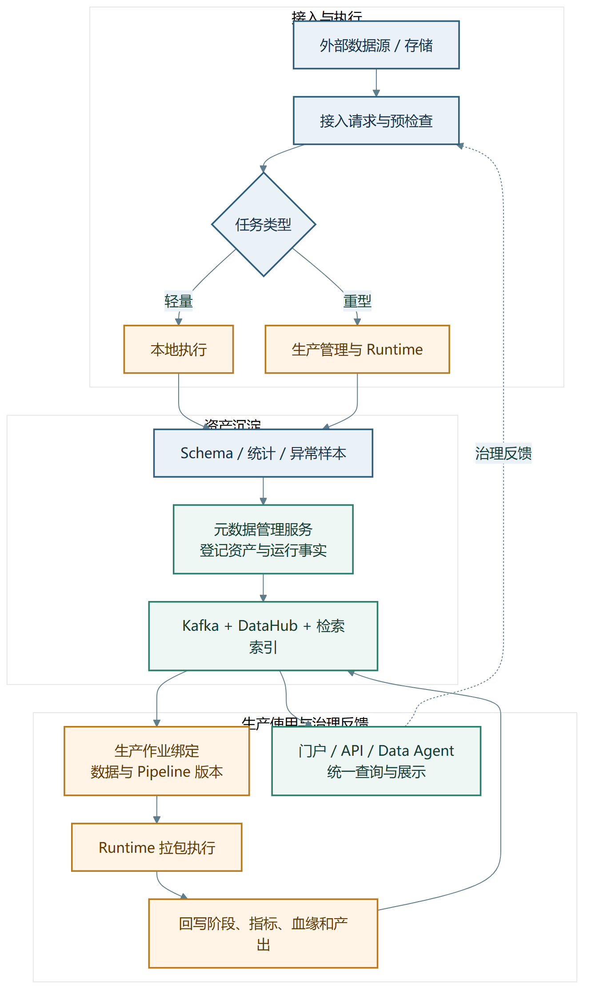

*图 9-1　DataInfra 从数据接入、任务执行、资产沉淀到生产使用和治理反馈的平台闭环。*

### 9.3 控制面、执行面、版本面和元数据面

项目文档把平台拆为四个相对独立的面：

| 平面 | 典型模块 | 核心职责 |
|---|---|---|
| 控制面 | Production Management、Runtime Manager | 作业控制、调度、恢复、状态管理 |
| 执行面 | Runtime Executor | 拉包、环境装配、执行、日志指标采集 |
| 版本面 | Version Registry | 版本注册、制品索引、校验、冻结与回滚 |
| 元数据面 | Metadata Management、Kafka、DataHub、Index | 资产、Schema、血缘、事件与查询 |

本人的工作主要集中在元数据面与统一接入层，并深入改造 DataHub 的认证、权限、GraphQL 和前端。生产管理、Runtime、版本管理等服务是项目整体组成，不全部归本人开发。

### 9.4 本人工作在项目中的位置

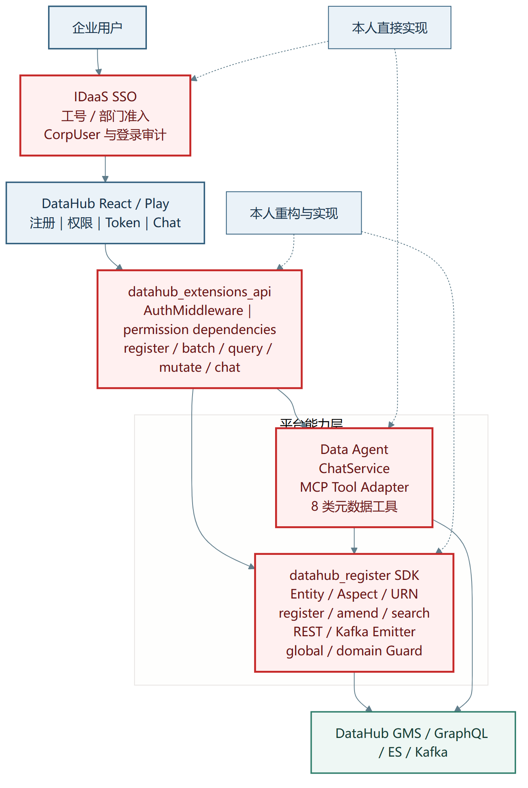

*图 9-2　DataInfra / DataHub 总体分层及本人直接实现、重构和协作适配的位置。红色边框用于强调有提交或设计文档支撑的本人工作，不表示其余模块均由本人开发。*

## 10. 元数据注册 SDK

### 10.1 从单体 EntityBuilder 到分层 SDK

早期实现把实体构造、接口、查询和发送集中在 `entitybuilder`。本人在 MR !173 中将其重构为 `datahub_register/metadata`，同时建立统一 API 网关。核心取舍是“SDK 优先、网关聚合、纯计算与 I/O 分离”。

```text
datahub_register/metadata/
├─ service/       MetadataService：业务流程编排
├─ entity/        MetadataEntity / Registry：URN、MCP 纯计算
├─ aspect/        Dataset / Pipeline / Task / Custom 数据结构
├─ data_access/   ES 搜索与 GraphQL 精确查询
├─ publish/       REST / Kafka Emitter 与 Aspect→MCP 转换
├─ permission/    SDK 直调路径的权限守卫
├─ config/        YAML + 环境变量配置
├─ templates/     三类实体注册模板
└─ test/          单元与集成测试
```

SDK 可以被 FastAPI 网关通过 HTTP 暴露，也可以被 pipekit、reconciler、runtime reporter 等进程内直接调用。这里的“被其他模块调用”证明注册能力的服务范围，不表示本人编写了所有调用方。

### 10.2 Entity—Aspect 建模

三类平台对象映射为 DataHub 实体：

| 平台对象 | DataHub 实体 | 标识结构 |
|---|---|---|
| Dataset | dataset | platform + name + environment |
| Pipeline | dataFlow | orchestrator + flow name + cluster |
| Task | dataJob | 所属 dataFlow + job ID |

`MetadataEntity` 提供 `from_dict/from_yaml/from_json`、`build_urn()`、`build_mcp_list()` 和 `validate()`。Aspect 子类用字段声明表达标准属性；未声明业务字段可以归入 `customProperties`，使平台扩展不必每次都修改 DataHub 核心模型。

建模层尽量保持纯计算：同一输入应生成同一 URN 和 MCP，不依赖网络状态。这使 URN、字段合并、必填项、血缘和自定义属性都可以在单元测试中独立验证。

### 10.3 注册主流程

当前 `MetadataService.register()` 的实际流程比“写一个实体”复杂得多：

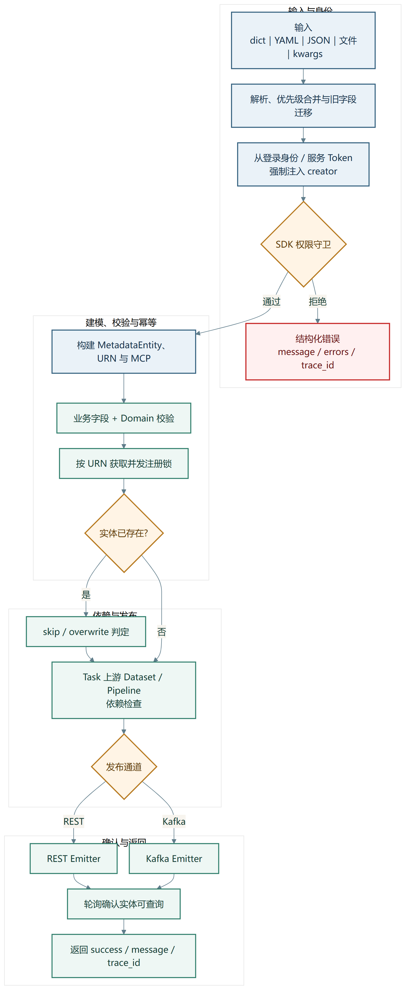

*图 10-1　MetadataService.register() 从多形态输入、身份与权限校验，到幂等注册、双通道发布和最终可查询确认的完整流程。*

这一流程体现了多个工程细节：

- **输入兼容：** 调用方可以用文件、字符串、字典或关键字参数；
- **身份事实不可伪造：** `creator` 由系统身份覆盖用户输入；
- **并发幂等：** 同一 URN 用注册锁串行化，避免并发重复创建；
- **依赖顺序：** Task 注册前检查关联 Dataset/Pipeline；
- **失败可处理：** 公共 API 以 `success/message/errors/trace_id` 返回，避免异常直接穿透网关；
- **最终一致性可见：** 写入后轮询，区分“发送成功”和“已可查询”。

### 10.4 amend：字段级合并与保护

`amend()` 面向已有资产修改，支持 merge、replace、overwrite 等策略和字段级策略。实现需先从 URN 或输入字段确定实体，读取现有数据，深度合并，检查不可变字段，再构造新 Aspect 并同步 DataHub 与索引。

数据集平台、环境和决定 URN 的关键字段不能在普通 amend 中随意变化，否则会形成“显示名称已改、实体主键未改”或“一个资产被拆成两个 URN”的不一致。代码对保护字段单独校验，并从 URN 回填可推导字段。

### 10.5 查询双路径

| API | 后端 | 一致性与能力 | 使用场景 |
|---|---|---|---|
| `search()` | ES / DataHub SDK | 模糊、分页、吞吐高，最终一致 | 资产发现、关键词与 customProperties 筛选 |
| `get()` | GraphQL | 实时、精确 | 读取完整实体和 Aspect |
| `exists()` | GraphQL | 实时、精确 | 注册前存在性与依赖检查 |

`search()` 还处理字段别名、custom property 的 CONTAIN 查询和结果构造。选择两条路径的原因不是重复实现，而是搜索和精确读取对一致性、性能和表达能力的要求不同。

### 10.6 Emitter 与写入路径

发布层通过工厂选择 REST 或 Kafka：

- REST 支持同步等待、主节点同步、异步及异步等待等模式；
- Kafka 将 MCP 发送到元数据事件 Topic，适合高频、可异步处理的路径；
- `ConverterRegistry` 负责把平台 Aspect 转为 DataHub MCP，包括血缘等特殊结构；
- Emitter 以懒加载单例形式复用连接和配置。

关键资产登记通常需要同步确认，高频 Runtime 状态更适合事件化。不能为了统一接口而强迫所有写入走同一种一致性路径。

## 11. 统一 API 网关与权限体系

### 11.1 网关职责

`datahub_extensions_api` 是 FastAPI 聚合层，负责：

- 启动时按配置激活 register、chat、preview 等 SDK；
- 统一中间件：认证、日志、错误处理和 CORS；
- 把前端同源 `/api/v1` 请求转换为 SDK 调用；
- 在业务逻辑前执行登录、角色、Domain 和资源权限校验；
- 对外提供模板、校验、注册、批量注册、查询、修改、存在性和权限摘要接口。

网关不重新实现 URN、MCP 和注册规则。把业务能力留在 SDK，可以保持库直调和 HTTP 两种路径的核心语义一致。

### 11.2 global 与 domain 两种模式

权限模式通过配置与环境变量灰度切换：

| 模式 | 判定依据 | 写权限 | Domain 的作用 |
|---|---|---|---|
| global | DataHub 全局原生角色 | Editor / Publisher / Admin 等 | 作为分类，仍做存在性校验 |
| domain | 用户在目标 Domain 的角色 | 目标域 Editor/Publisher/Admin | 参与细粒度授权 |

global 模式刻意不从所有用户的基线策略推断 Editor，避免把公共只读策略误判为全员可写。domain 模式支持多域 any/all 判定。Master Admin 有独立兜底。Publisher 是本人新增的第四级角色，用于把“可发布”与普通编辑进一步区分，并同步修改后端角色配置、前端角色选择和测试。

### 11.3 网关权限守卫

`dependencies.py` 提供 `require_login`、`require_reader`、`require_editor`、`require_publisher`、`require_admin`、`require_register_permission`、Domain 与资源级守卫。注册端点在进入业务逻辑前：

1. 从请求头提取用户 Token；
2. 向 GMS 解析用户身份和角色；
3. global 模式检查全局角色，domain 模式从请求体提取目标域；
4. 不满足时直接返回 403；
5. 通过后才调用注册 SDK。

`/permission/me` 返回当前模式、全局角色、可编辑/可读 Domain 和 `can_register`，前端是否显示注册入口与服务端写权限采用同源判定。隐藏按钮只是体验优化，真正安全边界仍在服务端。

### 11.4 服务级 Token 与用户级 Token

这是整个权限工程中最容易混淆的边界：

| Token | 代表 | 生命周期 | 用途 |
|---|---|---|---|
| 服务级 Token | 系统服务身份 | 容器启动注入，较稳定 | SDK 调用 GMS、GraphQL、Emitter 和 Domain 查询 |
| 用户级 Token | 最终用户身份 | 每个请求携带 | 网关或 SDK Guard 判断该用户是否有权操作 |

HTTP 路径采用“网关守卫鉴权 + SDK 可信执行”：网关用用户 Token 完成权限判断，SDK 再用服务级 Token 执行写入，避免重复查权。库直调路径通常没有用户 Token；当 `require_auth=false` 时按系统可信调用处理，保证 Runtime 高频上报不被人为用户鉴权阻塞。若调用方显式传入用户 Token，SDK `PermissionGuard` 仍可按相同 global/domain 口径判定。

### 11.5 Domain 存在性与权限是两道门

“用户能否写这个域”和“这个域是否存在”是不同问题：

- Permission Guard 检查角色和动作；
- Domain validation 检查元数据引用的域是否已经在 DataHub 注册；
- 两者各自有 `fail_closed`，含义不同；
- 即使网关暂时关闭权限或使用 global 模式，Domain 存在性仍可保持开启。

这一拆分防止用户凭写权限随意创造拼写错误或未治理的 Domain，也允许鉴权与数据质量分别灰度。

## 12. 企业 SSO 与访问控制

### 12.1 可插拔认证器

本人把企业 IDaaS SSO 接入 DataHub 认证链，并保持原用户名/密码、OIDC/OAuth 等方式可并存。功能用环境变量开关，未启用时相关 SDK 缺失不应阻止 DataHub 启动。为此，IDaaS SDK 的部分调用通过反射隔离，只有启用路径才加载。

认证链主要包括：

认证器、Filter、用户供应和会话建立的完整关系见图 12-1。

### 12.2 GMS 与 Play 的双进程回调

DataHub 的 GMS 和 Play 前端是两个独立 JVM，HTTP Session 不共享；IDaaS Servlet Filter 运行在 GMS，因此回调必须先到 GMS：

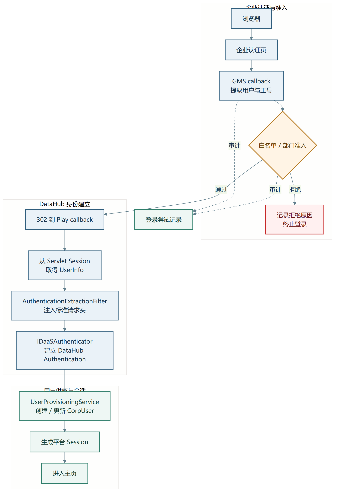

*图 12-1　企业 IDaaS SSO 在 GMS 与 Play 双进程条件下完成准入判断、认证建立、CorpUser 供应和平台 Session 创建。拒绝路径和登录尝试均保留审计记录。*

这项改造横跨 GMS Filter/Authenticator/Controller、Play 路由与 Controller、React 登录入口以及构建依赖，不能用“增加一个登录按钮”概括。

### 12.3 工号与部门准入

生产推荐 deny 模式，判定顺序为：

1. 规范化工号；
2. 先查工号白名单，命中立即放行，不依赖部门服务；
3. 未命中时查询部门信息；
4. 检查精确部门或 l0～l14 层级部门；
5. 不匹配或依赖失败时拒绝并记录。

另有 off 模式（不限制，但获取部门）和 allow 模式（不限制，也不查询部门），用于不同部署阶段。工号白名单优先的价值在于，即使部门接口短时异常，少量关键用户仍可通过显式授权访问；deny 模式的部门查询失败则采用 fail-closed，避免外部依赖异常变成越权入口。

### 12.4 运行时管理和审计

授权数据采用 JVM 内存与 MySQL write-through：读准入列表走内存，写操作同步持久化，启动时从数据库恢复。前端 Login Access 页面支持：

- 切换访问控制模式；
- 批量导入带姓名的工号白名单；
- 添加精确或层级部门；
- 查看允许/拒绝的登录记录；
- 从拒绝记录直接发起授权。

后台保存允许用户、允许部门、访问控制配置和登录尝试等数据，管理员 API 需要平台策略管理权限。该设计把一次性部署配置升级为可运营、可审计的运行时能力。

## 13. 永久 Token、前后端联动与安全边界

### 13.1 为什么需要无感 Token

门户用户通过 SSO 登录后，前端调用扩展 API 仍需要可被 GMS 识别的用户身份。如果每次都要求用户手工创建和复制 PAT，体验和运维成本都很高；如果全部使用服务 Token，又会丢失最终用户身份和权限边界。

本人实现的 Never Token 机制在登录或首次代理请求时为用户幂等创建长期 PAT，并把明文通过 GMS 的 SecretService 加密存入用户实体的专用 Aspect。Play 代理在短 TTL 缓存中读取该 Token；不可用时回退到 Session Token，不能因为 Token 辅助流程失败而阻断登录。

### 13.2 幂等创建与并发控制

`NeverTokenManager` 使用“实时 Aspect 读取 + 每用户锁 + 锁内二次检查”：

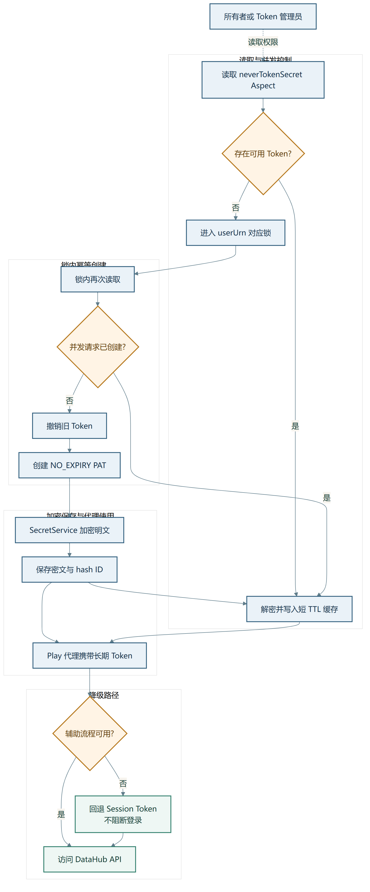

*图 13-1　Never Token 的实时读取、每用户锁、锁内二次检查、加密保存和 Session Token 降级路径。*

使用实时实体存储而不是 ES Token 列表做幂等判断，是因为 ES 最终一致可能在并发登录时暂时看不到刚创建的 Token。每用户锁只串行化同一用户，不阻塞不同用户。

### 13.3 存活性校验与自愈

专用 Aspect 本身可能仍存在，但它引用的 AccessToken 实体已经被撤销。GraphQL Resolver 会用保存的 hash ID 重建 Token URN，并检查实体是否仍然存在；若不存在则返回空，调用方重新创建。这样避免“秘密还在、Token 已死”导致系统永远误判为已配置。

只有 Token 所有者或具有 Token 管理权限的管理员可以读取解密后的明文。重置流程先撤销旧 Token，再创建新 Token，保证每个用户至多一个专用长期 Token。失败记录告警但不阻断登录，代理层回退到 Session Token。

### 13.4 前端同源调用

React 端通过统一的 authenticated fetch 获取用户 Token，并访问同源 `/api/v1`。Ingress 把页面和扩展 API 收口到同一域名，避免早期硬编码地址造成跨域和环境迁移问题。注册页、Chat 页、Token 页面、角色选择、白名单管理和配额入口与后端接口共同演进。

前端状态不能作为权限事实。例如，按钮隐藏后仍可能有人直接调用 API，所以服务端守卫必须保留；反过来，服务端允许而前端不展示也会形成可用性缺陷，因此 `/permission/me` 用同一判定口径驱动 UI。

## 14. Data Agent：元数据语义层与自然语言工具编排

### 14.1 定位

Data Agent 不是替代 DataHub，也不是让所有平台流量都经过 LLM。它位于用户意图与元数据操作之间：DataHub 提供事实元数据，注册 SDK 提供稳定操作，Agent 将“帮我找某类数据集”“查看上游血缘”“注册这份 YAML”等业务意图转成工具调用，再组织成自然语言回答。传统门户和 API 路径仍然保留。

### 14.2 内部分层

```text
datahub_chat/
├─ api/          FastAPI 请求模型和路由
├─ config/       LLM / DataHub 连接配置
├─ service/      ChatService：会话、流式响应、工具循环
└─ mcp/
   ├─ tool_adapter.py   客户端懒加载与统一执行
   └─ tools/
      ├─ datahub/       search / entity / lineage / schema / profile
      └─ register/      register / storage-url search / structured query
```

工具通过注册表装饰器自动登记，Adapter 在第一次执行时才创建 DataHub SDK、GraphQL Client 或 `MetadataService`。这种懒加载避免容器启动时因外部依赖短时不可达而直接失败，也允许没有注册 SDK 的环境先加载查询工具。

### 14.3 八类工具

| 工具 | 数据源 | 工程作用 |
|---|---|---|
| `search` | DataHub SDK | 关键词搜索多类实体 |
| `get_entity` | DataHub SDK | 按 URN 获取详情 |
| `get_lineage` | DataHub SDK | 查询上/下游血缘 |
| `get_schema` | DataHub SDK | 获取字段 Schema |
| `get_dataset_profile` | GraphQL | 获取行列和统计画像 |
| `register_metadata` | Register SDK | 通过 YAML 注册实体 |
| `search_by_storage_url` | Register SDK | 按对象存储路径发现资产 |
| `query_entity` | Register SDK | 按平台、环境、所有者等结构化查询 |

注册类工具复用 `MetadataService`，不会在 Chat 模块中再实现一套 URN、权限和 MCP 逻辑。工具执行还接收当前 actor 和 `can_register`，避免只依赖模型文本判断权限。

### 14.4 流式工具调用循环

`ChatService.chat_stream()` 采用 OpenAI 兼容 `/v1/chat/completions` 协议：

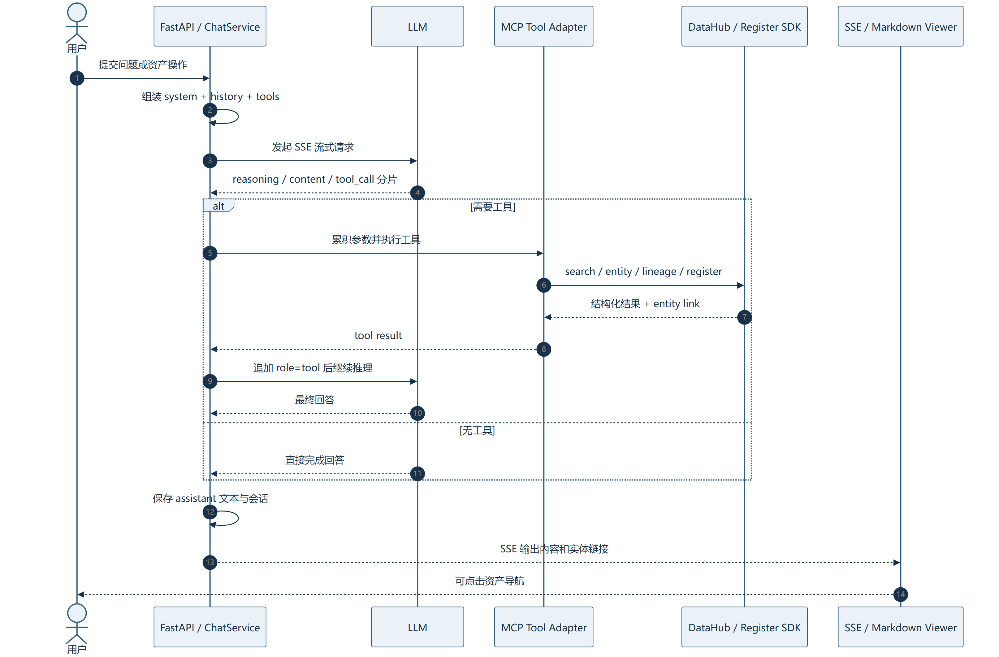

*图 14-1　Data Agent 从用户请求、SSE 推理流、MCP 工具执行到实体链接返回的时序。工具调用结果以 role=tool 重新送入模型，直至形成最终回答。*

工具循环设置最大轮次，防止模型持续互调。流式 `arguments` 必须按 call index 拼接，因为模型可能把一个 JSON 参数拆成多个 delta。配置、网络、JSON 和工具执行异常分别记录并返回可识别错误。

### 14.5 系统 Prompt 与用户级自愈

当前 `ChatService` 不只在代码中保存默认系统提示，还可以按用户读取和修复提示文档。逻辑包括确定目标 URN、读取文档、发现被软删除内容、重建或恢复，并提供 reset 接口。它使平台约束和输出规范可以作为元数据管理，但也要求权限和变更审计明确，避免普通用户改变全局提示。

### 14.6 元数据实体链接

本人在后续提交中为八个工具统一增加 `link` 字段。难点不在字符串拼接，而在 DataHub 前端路由和 Markdown 渲染：

- URN 类型与前端路径并非一一同名，例如 dataFlow 对应 pipelines；
- React Router 使用 DataHub 自定义 URN 编码，不能直接套通用 URL quote；
- Dataset/DataJob 的 URN 内部有括号和嵌套逗号，显示名解析必须按括号深度切分；
- Markdown 裸链接可能被括号截断，使用尖括号目标格式；
- `urn:` 不是 DOMPurify 默认允许协议，必须生成站内 `/dataset/<urn>` 路径。

最终链路为：工具返回 link → LLM 原样引用 → SSE → Markdown Viewer → DOMPurify → 前端路由解码 → 实体详情页。该修复让 Agent 输出从“给出一个 URN”变成可操作的资产导航。

### 14.7 当前限制

- 会话历史仍在进程内存中，重启丢失，多副本不共享；
- Chat 模块本身的权限需依赖网关 actor/can_register 传递，后续应继续做工具级审计；
- LLM 输出不等于事实，实体字段应以工具结果为准；
- 需要限制工具参数、结果大小和循环轮次，防止长上下文与误操作；
- 面向生产应将会话、工具审计和 Prompt 版本持久化。

## 15. 部署、测试与运行可靠性

### 15.1 自包含镜像与 Kubernetes

扩展服务使用基础依赖镜像和应用镜像两层构建，镜像内不固化真实 Token。Kubernetes 通过 Deployment、Service、Ingress、ConfigMap 和 Secret 组合部署；同源 `/api/v1` 指向扩展 API。权限、Domain 校验和模块启停可以通过环境变量和滚动重启灰度切换。

### 15.2 可靠性设计

| 风险 | 设计措施 |
|---|---|
| 外部 GMS/ES 短时不可达 | 超时、重试、fail-closed 可配置、明确错误结果 |
| 同一资产并发注册 | URN 级锁、存在性复查、skip/overwrite |
| 事件已发但索引未可见 | 写后验证轮询，区分发送与可查询 |
| 用户权限缓存过期 | TTL 缓存与用户/Domain 刷新接口 |
| 服务 Token 与用户 Token 混淆 | 分层配置、独立字段和调用路径 |
| 前端硬编码环境 | 同源 Ingress、运行时配置 |
| SSO 依赖失败 | 白名单优先、模式开关、登录审计、非关键 Token 流程降级 |
| Agent 外部依赖未就绪 | 工具客户端懒加载、模块开关、健康检查 |

### 15.3 测试资产

当前 `datahub_register`、`datahub_extensions_api` 和 `datahub_chat` 范围内约有 96 个非测试 Python/Java/TS/TSX 文件、约 2.02 万行；约 88 个 Python 测试文件、约 2.00 万行。该快照盘点不包含 DataHub 上游全部 Java/React 代码，也不等于个人代码量。

测试重点包括：

- URN、Aspect、MCP、字段校验、amend 合并与保护字段；
- REST/Kafka Emitter、ES/GraphQL 客户端和验证轮询；
- global/domain 权限、角色层级、缓存、fail-closed 和 creator 注入；
- 注册、批量、查询、修改、权限摘要和启动配置；
- SSO 工号规范化、DAO、Controller 和前端联动；
- Never Token 幂等、并发、自愈和 Resolver 权限；
- Chat 配置、流式响应、工具注册、懒加载、实体链接和异常路径。

### 15.4 生产验收建议

1. SSO：首次登录、重复登录、白名单、部门层级、拒绝与审计；
2. Token：并发登录只生成一个 Token，撤销后可自愈，越权读取被拒绝；
3. 权限：global/domain 分别验证 Reader、Editor、Publisher、Admin 和 Master Admin；
4. 注册：Dataset→Pipeline→Task 正常顺序，缺失依赖、非法 Domain、重复注册和并发注册；
5. 查询：ES 最终一致与 GraphQL 实时读取差异；
6. Agent：八个工具、连续两轮 tool call、无权限注册、异常依赖和实体链接；
7. 灰度：切换权限模式、关闭模块、Secret 更新和滚动重启；
8. 审计：关键写操作能够关联 actor、URN、trace ID 和结果。

## 16. 本人在 DataInfra / DataHub 中的工作

### 16.1 代表性提交

| 提交 | 规模 | 主要内容 |
|---|---:|---|
| `b6f7ef59` | 42 文件，+1,791/-19 | IDaaS SSO 接入，覆盖认证链、GMS、Play、React、构建与文档 |
| `e2013a93` | 30 文件，+5,074/-286 | 工号/部门准入、运行时管理、持久化、审计和测试 |
| `fe241aca` | 161 文件，+13,629/-14,882 | Extensions 分层重构、统一网关、注册 SDK、三级鉴权、Domain 校验与前端集成 |
| `360cc996` | 14 文件，+266/-13 | Publisher 角色、后端策略、前端角色与权限测试 |
| `9dd6c201` | 20 文件，+987/-94 | 永久 Token、GraphQL、Secret Aspect、Play/React 无感鉴权 |
| `65b1edb6` | 35 文件，+3,410/-25 | Data Agent、ChatService、MCP 工具、网关路由和测试 |
| `523ed8e2` | 26 文件，+817/-158 | Chat 配置修复、实体链接、启动与回归测试 |

规模来自指定提交的文本差异，包含源码、测试、配置和文档；大规模重构中的删除反映旧架构移除，不能用净行数评价难度。

### 16.2 保守个人口径与协作口径

当前本地历史中，本人发起并已合入 19 项 MR；这些 MR 包含 21 个本人署名非合并提交、20 个去重补丁，累计约 `+35,363 / -16,255` 行。这个口径适合答辩展示，因为它排除了由同事发起、但包含本人代码的 MR。

若采用更广的协作口径，共有 35 项已合入 MR 包含本人署名代码，其中 19 项由本人发起、16 项由同事发起；对应 37 个本人署名非合并提交、36 个去重补丁，约 `+42,185 / -16,988` 行。该口径说明协作覆盖面，不能写成“本人独立完成 35 项功能”。

同名 MR !247/!248 是不同请求但等价补丁，代码量只计一次；!246 明确为共同作者；DataInfra 中带 LiteLLM 名称的门户/代理改动不并入 Omni-ELB 工作量。

### 16.3 个人贡献的工程跨度

这组工作跨越了四个层次：

1. **底座改造：** DataHub GMS 认证、角色、Token Aspect、GraphQL Resolver；
2. **平台能力：** 注册 SDK、网关、权限、Domain、Emitter 和部署；
3. **用户体验：** Play/React 登录、白名单、注册页、角色、Token 和 Chat；
4. **智能交互：** Agent、工具编排、实体链接和流式对话。

它不是若干互不相关的页面和接口，而是围绕“身份可信—操作有权—元数据可注册—结果可查询—自然语言可使用”形成的工程链路。

### 16.4 边界说明

DataInfra 总体架构、生产管理、Runtime、版本服务、全部 DataHub 上游代码和所有消费者模块是团队项目能力。本报告只把有提交和设计文档支撑的 SSO、权限、Extensions、注册 SDK、Never Token 与 Data Agent 等归为本人直接工作。整体平台规模、业务效果和其他服务交付不按个人成果计数。

---

# 第三部分　Omni-ELB / LiteLLM：多集群入口路由与状态可靠性

## 17. 项目定位与服务架构

### 17.1 与 OmniPlacement 的区别

Omni-ELB 的 LiteLLM 路由发生在请求进入某个模型服务集群之前。它决定“选哪一套健康集群”，而不是“集群内 token 由哪个专家副本执行”。在 P/D 分离部署中，请求先进入 Prefill 入口，之后的 Decode 实例由集群内部组件管理；LiteLLM 不能直接决定某个请求在集群内部使用哪一台 D 实例。

### 17.2 服务组成

当前仓库的 LiteLLM 部署包包括：

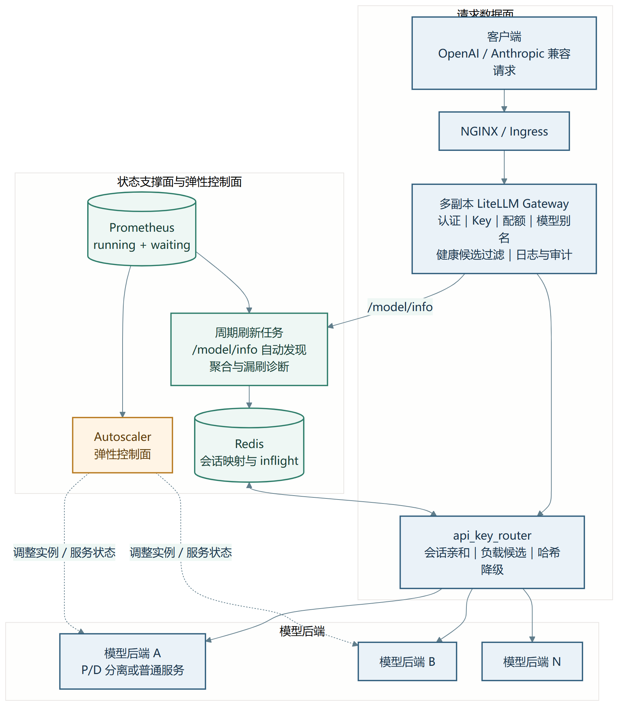

*图 17-1　Omni-ELB / LiteLLM 的请求数据面、状态支撑面、弹性控制面和多模型后端关系。请求路由只读 Redis，Prometheus 聚合由独立周期任务承担。*

仓库同时包含生产部署、模拟后端、压力脚本、模型注册脚本和 Autoscaler。项目整体能力不等于本人独立完成；本人的直接实现集中在路由架构共同设计、Redis 状态刷新和指标正确性修复。

### 17.3 数据面与控制面

- **请求数据面：** 健康候选过滤 → 路由决策 → 请求转发，要求低延迟和可降级；
- **状态支撑面：** 定期从模型配置和 Prometheus 读取负载，写入 Redis；
- **弹性控制面：** Autoscaler 根据策略和信号改变实例数量或服务状态，不在每个请求内执行。

三者应解耦。刷新失败不能阻塞所有请求；路由读取不到负载时应有稳定降级；Autoscaler 的分钟级动作不能被误写成每请求路由。

## 18. 当前路由算法

### 18.1 输入与优先级

`api_key_router.py` 在 LiteLLM 形成健康候选后执行。它从请求元数据提取：

1. `requester_metadata.user_id`；
2. Key Alias，用于识别 Pipeline Key；
3. `user_api_key_hash` 或 API Key，作为无 user ID 时的确定性路由键。

主要决策顺序为：

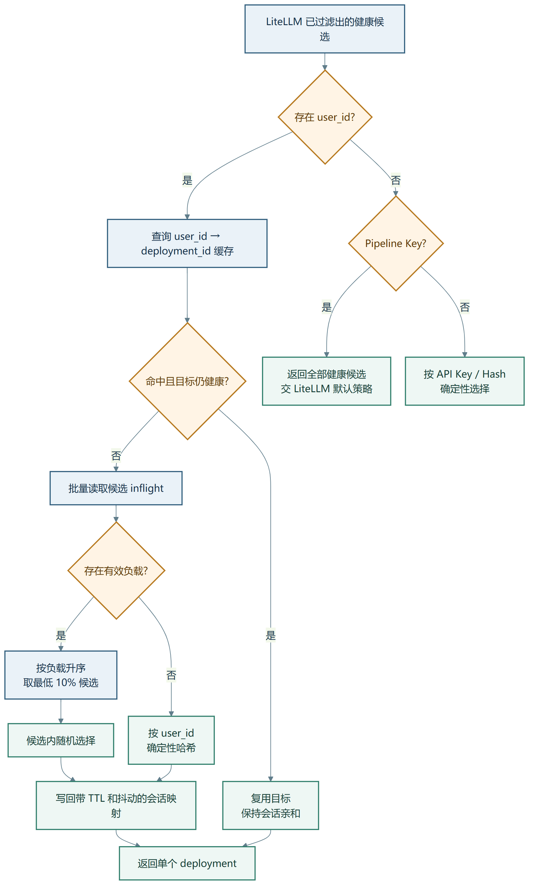

*图 18-1　当前路由器的决策优先级：健康会话复用、低负载候选、确定性哈希降级，以及 Pipeline Key 交回 LiteLLM 默认策略。*

### 18.2 会话亲和

Redis 中保存 `user_id → deployment_id`。只要目标仍在健康候选中，后续请求继续复用，避免会话在集群间漂移，增加前缀/KV 缓存重建。缓存设置长 TTL 并加入抖动，减少大量会话同时过期产生的重选尖峰。

健康性优先于亲和性：缓存命中的 deployment 若已不健康，必须重选。会话亲和也不是永久绑定；TTL、健康变化和缓存缺失都会触发重新决策。

### 18.3 低负载候选选择

路由批量读取每个健康 deployment 的 Redis inflight，负数被截为 0，解析失败按无有效值处理。候选按负载升序，取 `ceil(N × 0.10)`，至少一个，再随机选择。

这里的 10% 是候选集合比例，不是性能提升比例，也没有被理论证明为所有场景的最优常数。它在“永远选绝对最小”与“全量随机”之间折中：前者容易因观测延迟形成羊群效应，后者忽略负载。代码函数说明仍写“top 30%”，实际计算是 10%，应修正文档以避免误读。

### 18.4 无负载数据时的降级

如果 Redis 不可用、批量读取异常或没有解析出任何计数，路由不阻断请求，而是对排序后的 deployment ID 做 MD5 哈希取模。这样同一 user ID 仍能稳定落在一个节点，虽然失去负载感知，但不会因监控链路失败让业务完全不可用。

### 18.5 Pipeline Key 与普通 Key

Pipeline Key 返回全部健康候选，由 LiteLLM 的默认策略继续选择，适合系统级调用和跨部署均衡。非 Pipeline、无 user ID 的请求使用 Key Hash 保持确定性。代码中对特定兼容 Key 有额外路径，说明 Key 类型是业务协议的一部分，新增 Key 命名规则需要同步测试路由和指标。

### 18.6 算法一与内部验收

最终研究报告把当前已部署策略称为算法一，包含健康会话复用、输入形态分支和低负载候选选择。该方案在实际服务链路中部署，内部集群验证的 TTFT 较原方案降低 10%，并通过验收。这个数字反映整套路由方案在对应条件下的共同效果，不能拆成某个函数或某次提交的单独收益。

## 19. 负载状态刷新自闭环

### 19.1 为什么路由不直接查 Prometheus

每个请求实时查询 Prometheus 会增加延迟、依赖和故障面。当前系统把负载采集做成独立周期任务：聚合 P 侧 running+waiting，写入 Redis；路由只执行一次 MGET。这样监控查询的分钟级成本与请求路径的毫秒级要求分开。

### 19.2 原实现的静默漏刷风险

旧刷新脚本用人工维护的模型名和集群正则筛选 Prometheus。生产侧名称从下划线变为连字符等微小变化时，查询可能返回空，但脚本本身不报错；Redis 不再更新，路由仍读取旧值或默认值。这是比“任务失败”更危险的故障：系统表面正常，决策输入却已经失真。

### 19.3 本人实现的自动发现

独立刷新脚本启动时登录 LiteLLM，并调用 `/model/info`：

- 以 `model_name` 聚合成网关模型组；
- 取 `model_info.id` 作为 deployment/cluster 稳定标识；
- 从后端模型字段去掉 provider 前缀，以众数确定 Prometheus 模型名；
- 得到“模型组—部署 ID 集合”的实际配置，而不是人工推测。

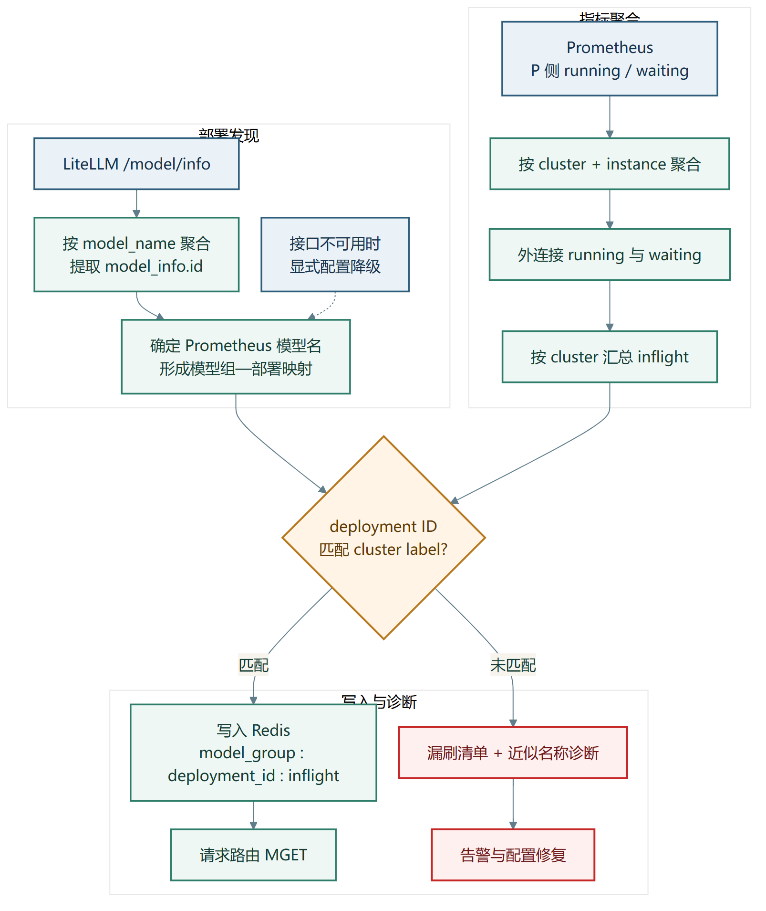

*图 19-1　从 `/model/info` 自动发现部署、聚合 Prometheus 指标、按 deployment ID 精确连接并写入 Redis 的刷新闭环。未匹配项进入显式诊断和告警路径。*

随后脚本只按 P/D 角色一次性查询全部 Prometheus 集群负载，以 `model_info.id == cluster label` 精确连接。Redis Key 使用与路由完全一致的模板：

```text
{model_group}:{deployment_id}:inflight
```

这种改造把“配置来源”从脚本常量改成服务自身的模型注册信息，减少命名漂移。

### 19.4 负载聚合

脚本分别查询 running 和 waiting 指标，先按 `(cluster, instance)` 聚合多条 engine 序列，再外连接并求和，最后按 cluster 汇总。外连接保证只有 running 或只有 waiting 的实例不会被丢掉。

当前写入值是 P 侧瞬时 `running + waiting` 请求数。它适合描述入口压力，但不等于剩余 token 工作量，也未表达 D 侧积压、请求长度和 APC 命中。异构模型或长短 prompt 混合时，原始请求数只能作为代理指标。

### 19.5 漏刷诊断

当 LiteLLM 部署 ID 在 Prometheus 中未命中，脚本不只打印数量，还用近似名称反查，将问题分成：

- **真没拉起：** Prometheus 中没有相近集群；
- **疑似命名脱节：** 存在高度相近但不相等的标签，需要补规则或修配置。

对于已知个别命名例外，保留小范围 rename 规则。LiteLLM API 不可达时，可以显式选择内置配置降级；报告要求在日志中标明数据来源，避免运维把降级结果误认为自动发现结果。

### 19.6 时效性仍需补强

准确连接解决“写错或漏写”，还需解决“多久以前写的”。后续应把值、刷新时间和来源一起写入，路由在读取时检查年龄；对过期状态退化为哈希，而不是把陈旧的 0 当作当前空闲。周期应根据负载变化速度选择，不能把固定十分钟视为所有模型都合适。

## 20. Prometheus 指标重复计数修复

### 20.1 故障根因

Pipeline Key 需要跳过部分 S3/DB 日志，代码通过 monkey patch 拦截 Logger。旧实现为了保留指标，在 DB Logger 的成功路径中又手动触发 Prometheus 成功回调。但 Prometheus Logger 本来已作为独立 callback 被 LiteLLM 的 success handler 调用一次，于是同一请求的 request、token 等指标被记两次。

### 20.2 修复方式

本人提交移除额外的 Prometheus 手动调用：

- Pipeline Key：跳过 DB/S3 日志后直接返回；
- Prometheus：由正常独立 callback 负责一次计数；
- 非 Pipeline Key：继续调用原 DB Logger 路径。

修复只有 1 个文件、净删除较多代码，但影响容量评估、告警阈值和路由验证。指标“看起来更低”不是业务请求下降，而是恢复为一次请求一次观测。

### 20.3 验证矩阵

应至少覆盖：普通 Key/Pipeline Key × 非流式/流式 × 成功/失败 × 有无重试，并比较请求真实数量与 Prometheus counter 增量。Token 指标还要检查 input/output 计数，避免只修请求 counter 而遗漏同一回调中的其他序列。

## 21. 部署、测试与后续演进

### 21.1 部署和运维资产

仓库提供容器编排、NGINX、多副本 LiteLLM、PostgreSQL、Redis、模拟后端、模型注册、冒烟和压力脚本；另有 Kubernetes 资源和 Autoscaler 目录。部署文档中的真实主机、地址和凭据属于环境信息，本报告不复制。

### 21.2 当前范围内的验证

路由测试应固定健康候选和 Redis 值，覆盖：

- 健康缓存命中；
- 缓存目标不健康后的重选；
- N 个候选的 10% 取整边界；
- 相同负载的随机性与统计分布；
- Redis 失败和空值的哈希降级；
- Pipeline Key 返回全集；
- user ID 缺失监控；
- 缓存 TTL 与抖动。

刷新测试应覆盖 `/model/info` 空数据、认证失败、同一模型组多个部署、重复 ID、Prometheus 部分缺失、名称例外、running/waiting 单边缺失、dry run、模型过滤和降级配置。

### 21.3 项目快照规模

在 `router`、`refresh-redis` 和 `autoscaler` 的统计范围内，当前约 45 个非测试 Python 文件、约 1.44 万行；测试和测试配置约 43 个文件、约 1.00 万行。这是项目子目录规模，不是本人工作量。本人两个已核验提交合计 `+563 / -820` 行，价值主要体现在关键状态链和观测正确性。

### 21.4 已设计但尚未作为本人交付的方向

SEG 材料讨论了以下方向：

- 根据 RPS/TTFT 做跨模型分时扩缩容；
- APC 命中率下降时把集群标记为 overloaded，只阻止新会话；
- 同权重不同服务名组成统一请求池；
- 以 prompt token 与 APC 命中修正“等效连接数”；
- D 侧积压交给集群内扩缩容，而不是让入口路由越权处理。

除 `/model/info` 驱动刷新已落地外，其余需按“已有模块、设计完成、待验证或畅想”分别标注。不能把方案图中的绿色框全部写成已上线功能。

## 22. 本人在 Omni-ELB / LiteLLM 中的工作

### 22.1 架构共同设计

用户已确认，当前“负载感知 + 会话亲和”的 LiteLLM 架构由本人和同事共同负责。报告将共同设计归为协作成果，不把完整路由器所有代码都归本人。

### 22.2 两项直接实现

| PR / 提交 | 变更 | 解决的问题 | 规模 |
|---|---|---|---:|
| !100 / `2967aea` | 独立 Redis 刷新脚本，通过 `/model/info` 自动发现部署，聚合 P 侧负载，补漏刷诊断和降级 | 人工正则随模型改名产生静默漏刷 | 6 文件，+559/-794 |
| !98 / `d387aa9` | 移除 Pipeline Key 路径的重复 Prometheus 成功回调 | 请求/token 指标翻倍 | 1 文件，+4/-26 |

### 22.3 工程价值

调度算法的上界受输入数据质量限制。即使选点代码完全正确，Redis 状态漏刷也会让结果错误；即使路由结果正确，Prometheus 重复计数也会误导容量规划和效果评估。本人两项工作分别修复“决策输入”和“效果观测”，构成调度系统闭环中常被低估的可靠性工作。

---

# 第四部分　跨项目工程方法、工作量与结论

## 23. 跨项目工程方法

### 23.1 稳定标识是分布式系统的骨架

三个项目的许多故障都可以归结为标识不稳定或两端口径不一致：

| 场景 | 稳定标识 | 若不一致会发生什么 |
|---|---|---|
| 专家部署 | layer、logical expert、global position、rank | 权重、统计和 selector 指向不同对象 |
| 元数据 | URN、Entity Type、Aspect Name、Domain | 重复资产、权限错配、查询不到刚写入对象 |
| 路由 | model group、deployment ID、cluster label、user ID | Redis Key 无法连接、会话漂移、负载漏刷 |

本人在工程中反复做的一类工作，就是把隐含在字符串、配置或页面里的标识提升为明确的数据模型，并让生产者和消费者共用同一构造规则。

### 23.2 观测—决策—执行—验证闭环

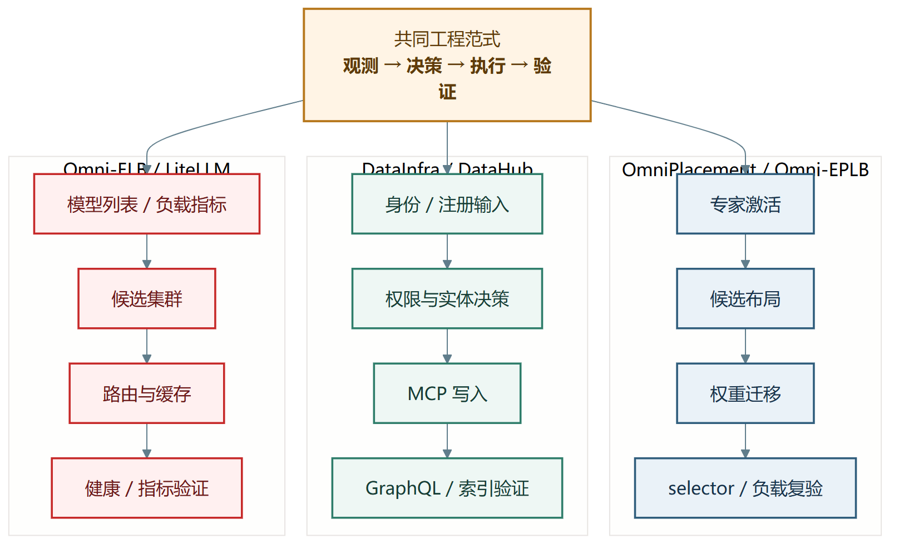

*图 23-1　三条工程主线共享的“观测—决策—执行—验证”范式。三者的业务对象和执行粒度不同，本图只总结工程方法，不表示它们已经组成一套产品架构。*

只实现“决策函数”不等于交付一个系统。观测错误会让决策失真，执行缺少一致性会破坏服务，验证缺失会让失败静默发生。因此，本报告把刷新、诊断、锁、缓冲、握手、审计和测试都视为核心工程工作，而不是算法外的附属代码。

### 23.3 高频路径与低频路径分离

- 激活在 NPU 侧低开销累加，复杂布局计算在后台窗口执行；
- Runtime 高频元数据经 Kafka 异步，门户关键登记可同步确认；
- 路由每请求只读 Redis，Prometheus 聚合由周期任务完成；
- 权限结果和 Never Token 使用 TTL 缓存，修改与自愈走较低频控制路径。

这种拆分减少主路径对慢依赖的暴露，但带来状态年龄和最终一致性问题，因此必须增加时间戳、轮询、版本和降级规则。

### 23.4 安全切换模式

三个系统都使用“准备—校验—生效”而不是直接覆盖：

- EPLB 先接收权重到缓冲，再在安全点复制和更新 selector；
- 元数据先校验身份、权限、Domain 和依赖，再发 MCP；
- 路由先检查缓存目标仍健康，负载不可用时降级到稳定哈希；
- Never Token 先验证引用的实体存活，失效才撤销并重建。

### 23.5 可测试边界

纯计算函数应尽量无外部依赖：副本分配、Pattern 校验、URN 构造、Aspect 转换、权限矩阵、实体链接和哈希选点都适合单测。HCCL、GMS、Redis、Prometheus、SSO 和 LLM 属系统边界，应通过 mock、集成测试和受控环境验证。把两类测试混在一起，会导致单测慢且脆弱，系统测试又无法定位问题。

### 23.6 可观测性本身需要正确性

监控不是天然可信。需要验证：

- 指标是否重复触发；
- gauge 是瞬时值还是 counter 差分；
- 数据更新时间是否在允许范围；
- 聚合维度是否遗漏 instance/engine；
- 失败是否被写成 0；
- 日志是否能关联 trace、actor、URN、layer、round 和 deployment。

Pipeline Key 指标翻倍和模型改名漏刷说明，观测链路也需要代码评审、测试和版本管理。

## 24. 个人工作量与证据汇总

### 24.1 可核验的保守口径

| 项目 | 可核验个人范围 | 去重代码变更 | 说明 |
|---|---|---:|---|
| OmniInfer / OmniPlacement | 13 项现存合入记录；27 个本人提交；26 个去重补丁 | +7,820 / -9,993 | 排除 2 项非 Placement；历史内部工作另列，不虚增合入数 |
| DataInfra（答辩保守口径） | 本人发起并合入 19 项 MR；21 个本人提交；20 个去重补丁 | +35,363 / -16,255 | 含源码、测试、配置、文档；一项共同作者 |
| DataInfra（协作覆盖口径） | 35 项合入 MR 含本人署名代码；37 个提交；36 个去重补丁 | +42,185 / -16,988 | 其中 16 项由同事发起，不能称个人独立 MR |
| Omni-ELB / LiteLLM | 2 项本人提交 | +563 / -820 | 负载刷新自闭环、Prometheus 重复计数修复 |

以上三行不能简单求和为“个人总新增代码”，因为 DataInfra 两种口径互相包含，OmniInfer 与独立 Omni-EPLB 存在同源迁移，删改行也不等于当前代码资产。

### 24.2 过程性工作量

仅凭现存开源 Git 会漏掉 OmniPlacement 的开源前研发。历史活动至少证明：

- 2025 年 3 月已参与专家相关原型和安装化；
- 3 月下旬进入 C++ optimizer、参数和 UT；
- 4 月形成多冗余、收益门禁、静态/动态 Pattern 和层间差异讨论；
- 4～6 月持续迭代交换、Hungarian、greedy/bucket、停止条件和验证；
- 6～7 月完善规模配置、动态冗余、Pattern 流水线、绘图和触发接入。

这些记录说明工作的连续性和研发深度，但由于缺少完整平台状态，不将 46 项旧 MR 创建记录改写成 46 项合入成果，也不推算无法恢复的代码量。

### 24.3 工作类型而非单一数字

本人工作量应同时从以下维度理解：

| 维度 | 代表工作 |
|---|---|
| 研究到实现 | 专家副本/放置方法转为 C++/Python/HCCL 闭环 |
| 架构与重构 | DataHub Extensions 161 文件分层重构与旧架构删除 |
| 跨栈开发 | Java、Python、C++、TypeScript、GraphQL、Shell、YAML |
| 系统集成 | NPU/HCCL、DataHub、Kafka、Redis、Prometheus、LiteLLM、K8s |
| 质量与运维 | UT、测试流水线、诊断、审计、灰度、降级和文档 |
| 缺陷闭环 | YAML/模型适配、跨域、Token、自愈、漏刷、指标重复 |

代码行数很大时可能只是迁移，代码行数很小时也可能修复关键观测语义。答辩中应把数字与“问题—决策—实现—验证”一起展示。

### 24.4 团队成果与个人成果对照

| 内容 | 建议表述 |
|---|---|
| OmniInfer 论文与组件消融 | “团队系统在给定配置下取得……；本人负责 OmniPlacement 的若干算法与工程模块。” |
| OmniPlacement 技术报告 | “本人参与/共同完成相关技术报告和工程实现。”不把全报告和全部点击量独占化 |
| DataInfra 平台 | “项目形成……；本人主导或实现 SSO、Extensions、注册、权限、Token 和 Agent 等能力。” |
| Omni-ELB 路由架构 | “与同事共同负责当前架构；本人直接完成刷新和指标两项可靠性改造。” |
| 10% TTFT | “算法一整体方案在内部集群验证中降低 10% 并通过验收。”不拆成个人单个提交收益 |

## 25. 风险、限制与后续建议

### 25.1 OmniPlacement / Omni-EPLB

**现有限制：**

- 激活次数只是计算负载代理，未完整包含通信、批大小、算子效率和设备异构；
- 运行时候选按代理不均衡度接受，迁移时间和热点持续时间尚未全部在线建模；
- 采集周期与注释存在不一致，配置变更的可审计性需加强；
- Pattern 工具中部分拓扑参数为固定假设，应由配置或拓扑发现提供；
- 动态更新需要更强的故障注入和长稳测试。

**优先建议：**

1. 为统计窗口、Pattern 和 selector 增加显式版本号；
2. 记录每次更新的预计收益、实际迁移成本和生效后实测收益；
3. 把拓扑、带宽与设备速率纳入候选评分；
4. 统一代码注释、配置默认值和用户指南；
5. 建立从 dump、Pattern、加载到性能结果的可追溯实验 manifest。

### 25.2 DataInfra / DataHub

**现有限制：**

- 权限分布在 DataHub 资产层和平台控制层，需要统一审计与策略说明；
- 服务级 Token 权限较大，必须最小化并定期轮换；
- Never Token 为长期凭据，应持续评估到期、撤销、密钥轮换和泄露响应；
- Agent 会话仍在内存，工具写操作和 Prompt 变更需要更完整审计；
- ES 与 GraphQL 双路径带来最终一致和实时结果差异，需要在 API 中显式表达。

**优先建议：**

1. 为注册、修改、Agent 工具写操作统一审计事件；
2. 将 Chat session 和工具调用记录持久化，支持多副本；
3. 统一 global/domain 角色矩阵的自动化契约测试；
4. 为服务 Token 建立最小权限、轮换和不可用演练；
5. 继续把平台对象协议与 DataHub 上游改造隔离，降低升级成本。

### 25.3 Omni-ELB / LiteLLM

**现有限制：**

- inflight 是 P 侧请求数，不能完整表示 token 工作量和 D 侧压力；
- 刷新周期较长时，低负载 10% 可能基于陈旧数据；
- Redis 缺值与真实 0 的语义需要进一步区分；
- 绝对最小集合内随机仍可能在突发流量下形成同步重选；
- Pipeline Key 使用 monkey patch，升级 LiteLLM 时需检查被补丁方法签名。

**优先建议：**

1. Redis 值增加 `value/timestamp/source/version`；
2. 对负载缺失、过期、异常突变分别计数和告警；
3. 在受控实验中比较请求数、token 加权、TTFT 预测等信号；
4. 将路由插件从 monkey patch 逐步迁移到更稳定的正式扩展接口；
5. P 侧路由与 D 侧容量分开治理，避免入口层承担集群内部不可控决策。

### 25.4 保密与外部提交

外发前需再次检查：内部域名/IP、仓库地址、员工编号、AK/SK/Token、真实业务规模、未公开模型名、部署拓扑、客户或部门信息。性能数据优先使用获批的相对值、归一化值或范围，并保留完整原始证据在内部环境。

## 26. 结论

本人博士后期间的工程工作形成了三个互相独立、又在工程方法上连续的实践域。

在 OmniPlacement / Omni-EPLB 中，工作从专家激活与布局算法延伸到 C++ 优化器、HCCL 权重迁移、主/后台一致性、Pattern 工具、多模型接入和测试体系，体现了把研究问题变成可运行 SDK 的全过程。现存 Git 只能覆盖后半段，开源前历史进一步证明本人从原型和核心优化器阶段即持续参与。

在 DataInfra / DataHub 中，本人承担了企业平台从“能登录”到“身份可控”、从“能写元数据”到“SDK/网关/权限分层”、从“页面操作”到“Data Agent 工具化”的多层建设。代表性重构一次涉及 161 个文件，后续又连续完成 Publisher、Never Token 和 Agent 等能力，体现了跨后端、前端、模型、接口、部署和测试的系统工程工作量。

在 Omni-ELB / LiteLLM 中，本人与同事共同建设负载感知和会话亲和路由，本人直接修复状态刷新和指标计数两个关键可靠性问题。这些工作说明，工程价值不只存在于新算法，也存在于让算法获得正确输入、输出可信指标并在故障时安全退化。

综合来看，本人的核心能力不是单点编码，而是：从实际故障或性能瓶颈抽象问题；建立稳定模型和模块边界；跨语言完成实现；通过测试、诊断、灰度和证据台账把功能变成可交付、可维护、可复核的工程系统。

---

# 附录

## 附录 A　关键模块—文件映射

### A.1 OmniPlacement / Omni-EPLB

| 文件或目录 | 说明 |
|---|---|
| `omni_placement/omni_planner.py` | Python 总入口；分布式初始化、Mapping、激活记录、动态线程和框架接口 |
| `omni_placement/expert_mapping.py` | Pattern 加载、逻辑—物理映射、selector、冗余层与槽位计算 |
| `omni_placement/cluster_status.py` | 集群状态张量和状态动作 |
| `omni_placement/placement_handler.py` | 模型参数过滤、权重初始化、C++ 对象构造 |
| `omni_placement/distributed_ops.py` | Python 侧 mapping/activation 分布式辅助操作 |
| `cpp/expert_activation.cpp` | NPU 激活计数、AllGather、窗口差分、dump、逻辑工作量聚合 |
| `cpp/expert_load_balancer.cpp` | 不均衡度、候选预算、副本与放置、收益门禁 |
| `cpp/placement_optimizer.cpp` | 当前/目标布局求差，生成 ADD/REMOVE 指令和调试摘要 |
| `cpp/dynamic_eplb_greedy.cpp` | 另一套动态贪心负载均衡实现与指令生成 |
| `cpp/placement_manager.cpp` | worker 生命周期、指令批次、权重更新与主线程生效 |
| `cpp/placement_mapping.cpp` | Pattern、物理位置、selector 和一致性检查 |
| `cpp/moe_weights.cpp` | 专家权重地址与替换 |
| `cpp/distribution.cpp` | HCCL context、send/recv/allgather、本地复制、缓冲和握手 |
| `utils/omni_pattern_tool/step_1_*` | 激活日志/文本转 CSV |
| `utils/omni_pattern_tool/step_2_*` | 副本数与设备放置、生成 Pattern |
| `utils/omni_pattern_tool/step_3_*` | Pattern 合法性检查与部署视图 |
| `utils/omni_pattern_tool/step_4_*` | 负载热图、柱状图和分析 CSV |
| `utils/omni_pattern_tool/pipeline.py` | 四步流水线编排、参数和日志 |
| `tests/` | Python 配置、Planner、Mapping、优化器和工具测试 |
| `omni_placement/cpp/test/` | C++ 激活、映射、负载均衡、通信和张量测试 |

### A.2 DataInfra / DataHub

| 文件或目录 | 说明 |
|---|---|
| `libs/datahub_extensions/datahub_register/metadata/service/metadata_service.py` | register/amend/search/get/exists，流程、锁、依赖、验证和权限接入 |
| `.../entity/metadata_entity.py` | Entity/URN/MCP 构造与校验 |
| `.../entity/registry.py` | Dataset/Pipeline/Task 类型注册 |
| `.../aspect/` | 各类平台元数据结构 |
| `.../publish/` | REST/Kafka Emitter 和转换器 |
| `.../data_access/` | ES 模糊搜索与 GraphQL 精确查询 |
| `.../permission/guard.py` | SDK 路径 global/domain 权限守卫 |
| `datahub_extensions_api/api/main.py` | FastAPI 入口和中间件 |
| `.../api/lifecycle/startup.py` | 模块化启动、SDK 注入与资源生命周期 |
| `.../api/routers/register.py` | 模板、校验、注册、批量、查询、修改、权限摘要 |
| `.../api/permission/dependencies.py` | 登录、角色、Domain 和资源依赖守卫 |
| `datahub_chat/chat/service/chat_service.py` | 多轮会话、SSE、reasoning/content 和 tool call 循环 |
| `datahub_chat/chat/mcp/tool_adapter.py` | 客户端懒加载、依赖注入与统一工具执行 |
| `datahub_chat/chat/mcp/tools/` | 八类元数据工具、注册表、实体链接 |
| `third_party/datahub/.../IDaaSAuthenticator.java` | IDaaS 身份桥接 |
| `third_party/datahub/.../IDaaSAuthController.java` | SSO 回调、准入和管理员 API |
| `third_party/datahub/.../IDaaSAuthDao.java` | 白名单、部门、配置与登录记录持久化 |
| `third_party/datahub/.../NeverTokenManager.java` | 长期 Token 幂等创建、缓存、自愈和重置 |
| `third_party/datahub/.../GetNeverTokenResolver.java` | Token Secret 权限读取、解密与存活性校验 |
| `third_party/datahub/datahub-web-react/...` | 登录、权限、注册、Token、Chat 和实体页面适配 |

### A.3 Omni-ELB / LiteLLM

| 文件或目录 | 说明 |
|---|---|
| `litellm/router/api_key_router.py` | user ID 会话亲和、低负载候选、Pipeline Key 与哈希降级 |
| `litellm/k8s/refresh-redis/gen_inflight_script_standalone.py` | `/model/info` 自动发现、Prometheus 聚合、Redis 写入与漏刷诊断 |
| `litellm/k8s/refresh-redis/run_inflight_refresh.sh` | 周期刷新入口 |
| `litellm/router/pipeline_key_log_filter.py` | Pipeline Key 日志过滤与指标去重 |
| `litellm/docker/` | 多副本网关及支撑组件编排 |
| `litellm/config/` | 模型、路由、配额和 Autoscaler 配置 |
| `litellm/autoscaler/` | 弹性控制器、策略、信号、Provider 和 Actuator |
| `litellm/tests/` | E2E、压力、指标和路由验证 |
| `litellm/design/` | 容量、亲和、弹性和部署设计 |

## 附录 B　可核验 PR/MR 清单

### B.1 OmniInfer / OmniPlacement 的 13 项现存合入记录

| PR | 合入日期 | 原始标题（保留历史拼写） | 主要归类 |
|---|---|---|---|
| !32 | 2025-07-08 | refine the pattern genneration util for omniplacement | Pattern 工具 |
| !82 | 2025-07-16 | refine the omniplacement code to support EP144 shared experts situation | 共享专家 |
| !91 | 2025-07-16 | refine the logic of uneven redundant layers | 层间冗余 |
| !303 | 2025-08-27 | support batch-send in omniplacement, support dynamical static algorithm in omniplacement | 通信与动态/静态 |
| !349 | 2025-08-14 | modify the readme in pattern generation utils in omniplacement | 文档与工具 |
| !573 | 2025-09-10 | Omniplacement UT 使能 最新代码 | 测试流水线 |
| !805 | 2025-10-22 | omniplacement add support for longcat zero expert | 模型适配 |
| !911 | 2025-10-25 | update CLI template for new omni placement config | CLI/配置 |
| !948 | 2025-10-27 | add new omniplacement config in omnniplacement md | 配置文档 |
| !1010 | 2025-10-30 | fix typos for CLI in 18P1D | CLI 修复 |
| !1011 | 2025-10-30 | fix typos in CLI 18P1D | CLI 修复（等价补丁去重） |
| !1775 | 2025-12-25 | fix issue IDDA7J, refine omniplacement yaml update logic | 缺陷与 YAML |
| !2032 | 2026-03-04 | add feature for omni eplb to enable creating new hccl context | HCCL context |

### B.2 DataInfra 本人发起并合入的 19 项 MR

| MR | 合入日期 | 原始标题 | 主要归类 |
|---|---|---|---|
| !52 | 2026-05-13 | feat(auth): integrate Huawei IDaaS SSO into DataHub authentication | SSO |
| !99 | 2026-05-27 | 实现工号白名单访问控制与运行时授权管理 | 准入/审计 |
| !170 | 2026-06-23 | 白名单增加姓名列支持和excel格式导入 | 管理体验 |
| !172 | 2026-06-24 | 修复生产环境中注册页面因跨域请求导致的“Failed to fetch”错误 | 前端/部署 |
| !173 | 2026-06-25 | 重构 datahub_extensions 架构+统一 API 网关+并新增三级鉴权+Domain 注册校验+注册 SDK 能力+前端集成 | 核心重构 |
| !178 | 2026-06-26 | datahub_register / datahub_extensions_api 单元测试补充+文档添加 | 测试/文档 |
| !187 | 2026-07-02 | 新增 global 鉴权模式+register不展示pipeline/task | 权限/前端 |
| !208 | 2026-07-10 | 替换前端品牌标识为DataInfra | 前端 |
| !216 | 2026-07-07 | 修复全局模式读权限逻辑 | 权限修复 |
| !228 | 2026-07-09 | Task-Mgr 用户角色透传 | 服务集成 |
| !242 | 2026-07-13 | 新增 Publisher 角色 | 角色模型 |
| !245 | 2026-07-14 | 修复litellm-ui页面因鉴权问题导致无法访问的问题 | 门户鉴权 |
| !246 | 2026-07-15 | 归档测试环境配置(co-author with 张宁) | 协作/配置 |
| !247 | 2026-07-15 | 修复注册页 YAML 编辑器光标问题 | 前端修复 |
| !248 | 2026-07-16 | 修复注册页 YAML 编辑器光标问题 | 等价补丁 |
| !249 | 2026-07-20 | 注册API直连扩展 | SDK/调用路径 |
| !271 | 2026-08-11 | 新增永久Token自动发放与无感知鉴权 | Token/安全 |
| !351 | 2026-09-02 | 新增DataHub聊天模块 | Data Agent |
| !376 | 2026-09-09 | 修复聊天配置并添加实体链接支持 | Agent/实体导航 |

### B.3 Omni-ELB / LiteLLM

| PR / 提交 | 日期 | 标题 | 主要归类 |
|---|---|---|---|
| !98 / `d387aa9` | 2026-08-19 | fix(pipeline_key_log_filter): 修复 pipeline key 请求 prometheus 指标翻倍 | 可观测性正确性 |
| !100 / `2967aea` | 2026-09-01 | add standalone redis refresh python script | 状态刷新可靠性 |

## 附录 C　构建、复现与验收清单

### C.1 Omni-EPLB 基础构建

以下命令仅表达公开仓说明中的流程；实际执行需准备与目标设备匹配的 Linux、CANN、PyTorch 和 torch-npu 环境：

```bash
cd <omni-eplb>
./build/build.sh
./tests/run_test.sh
```

静态 Pattern 的推荐流程：

```bash
# 1. config.yaml 开启 enable_dump 并设置 dump_dir
# 2. 用固定请求集运行服务并收集激活
# 3. 生成 Pattern
./pattern_generation_pipeline.sh \
  --input_txt_folders <dump_dir> \
  --num_ranks_target_pattern <num_ranks> \
  --collecting_modes decode

# 4. 检查生成的 .npy、部署视图、热图和分析 CSV
# 5. 关闭 enable_dump，把 pattern_path 指向通过校验的文件
```

验收记录至少包含：代码 commit、配置文件 hash、模型/量化、设备与拓扑、请求集、统计窗口、Pattern 文件 hash、启用前后指标、重复次数和异常日志。

### C.2 DataInfra 模块验收

建议按以下顺序，而不是一次性只做页面冒烟：

```text
1. 单元层：URN / Aspect / MCP / permission / entity link
2. SDK 层：register / amend / search / get / exists
3. 网关层：AuthMiddleware / require_* / API response
4. DataHub 集成：GMS / GraphQL / ES / Kafka
5. 身份层：SSO / whitelist / department / audit / Never Token
6. Agent 层：SSE / tool call / permissions / entity links
7. 部署层：ConfigMap / Secret / Ingress / rolling update
```

安全测试必须包括：无 Token、失效 Token、Reader 写操作、跨 Domain 写、管理员越权边界、Token 所有者读取、他人 Token 读取、服务 Token 缺失、GMS 不可达和 fail-closed。

### C.3 LiteLLM 路由复现

使用模拟后端时固定 deployment ID 和 Redis 值：

```text
Case 1：user_id 首次请求 → 低负载候选 → 写缓存
Case 2：相同 user_id → 命中健康缓存 → 相同目标
Case 3：缓存目标移出健康集合 → 重选并更新缓存
Case 4：Redis 无数据 → 确定性哈希
Case 5：Pipeline Key → 返回全部健康候选
Case 6：缺少 user_id → 监控计数增加，路由仍可用
```

刷新脚本要保存 `/model/info` 摘要、Prometheus 集群集合、命中/未命中清单、疑似改名、生成时间和最终 Redis Key 数。不要在报告或日志中保存明文密码和 Token。

### C.4 文档与代码一致性检查

发布前自动或人工核对：

- 默认值是否与配置文件一致；
- README 百分比是否与代码计算一致；
- 注释中的周期是否与实际秒数一致；
- 路由 Key 模板在写端和读端逐字一致；
- global/domain、Reader/Editor/Publisher/Admin 的矩阵在前后端一致；
- Agent 工具清单与注册表实际数量一致；
- Pattern 的维度定义在工具、SDK 和框架适配层一致。

## 附录 D　核心术语

| 术语 | 本报告中的含义 |
|---|---|
| MoE | Mixture of Experts，稀疏激活的混合专家模型 |
| 逻辑专家 | 模型门控选择的专家语义 ID |
| 物理专家/副本 | 实际部署在设备槽位中的权重实例 |
| Pattern | 描述 rank、层和专家部署关系的三维矩阵 |
| selector | 运行时从逻辑专家选择物理位置的映射张量 |
| EPLB | Expert Placement Load Balancing，专家放置负载均衡 |
| rank | 分布式设备或进程标识，具体含义由并行配置确定 |
| HCCL | 昇腾集合通信库，本报告用于激活聚合与权重传输 |
| TTFT | Time To First Token，首 token 时延 |
| TPOT | Time Per Output Token，生成阶段每输出 token 时间 |
| E2E | 请求到完整响应的端到端时延 |
| URN | DataHub 中实体的稳定唯一标识 |
| Entity | Dataset、DataFlow、DataJob、CorpUser 等元数据实体 |
| Aspect | 附着在实体上的一个元数据侧面 |
| MCP | Metadata Change Proposal，DataHub 元数据变更提案 |
| GMS | Generalized Metadata Service，DataHub 后端服务 |
| Domain | 数据资产治理域，不等同于网络域名 |
| 服务级 Token | 平台服务访问 GMS 的系统凭据 |
| 用户级 Token | 表示最终用户身份、用于鉴权的凭据 |
| Data Agent | 以 LLM 工具调用封装元数据查询和注册的语义交互层 |
| model group | LiteLLM 暴露给调用方的逻辑模型组 |
| deployment ID | 模型组下一个实际后端部署的稳定标识 |
| inflight | 当前实现中 P 侧 running+waiting 的请求数代理 |
| session affinity | 同一用户/会话尽量复用同一健康后端 |
| Pipeline Key | 触发系统级输入形态和默认 LiteLLM 调度的 Key Alias |

## 附录 E　证据路径与快速审阅指南

### E.1 本地证据路径

| 内容 | 路径 |
|---|---|
| 最终研究报告 | `20260921/博士后研究报告-陶壮.docx` |
| 材料总计划 | `博士后出站考核材料撰写计划.md` |
| PR/MR 核对台账 | `PR核对与开源前工作梳理_20260911/PR_MR逐项核对与开源前工作总结.md` |
| 开源前活动 | `历史记录.txt` |
| OmniInfer 证据仓 | `相关项目/omniinfer` |
| Omni-EPLB 证据仓 | `相关项目/omni-eplb` |
| DataInfra 证据仓 | `相关项目/data_infra_platform` |
| Omni-ELB 证据仓 | `相关项目/omni-elb` |
| LiteLLM SEG 报告 | `D:/0608lc/omni-elb报告准备/SEG技术评审报告.md` |
| LiteLLM 详细算法报告 | `D:/0608lc/omni-elb报告准备/litellm调度算法报告.md` |

项目仓库用于证据读取，本报告生成过程未修改其代码、配置或 Git 历史。

### E.2 评审者快速阅读路线

如果只有 15 分钟，建议按以下顺序阅读：

1. 摘要与第 1 章，了解三项目边界；
2. 第 3～5 章，了解 OmniPlacement 的完整运行时闭环；
3. 第 8 章，了解本人在核心主线中的可核验贡献；
4. 第 10～14 章，了解 DataInfra 从注册、权限、SSO 到 Agent 的跨栈实现；
5. 第 16 章，查看 DataInfra 个人工作量；
6. 第 18～20 章，查看 LiteLLM 路由、刷新和指标修复；
7. 第 24 章和附录 B，核对数字与 PR/MR。

### E.3 现场演示建议

一个可控制在 20 分钟内的工程演示可以包含：

1. 用固定小型激活数据运行 Pattern 生成，展示 `.npy`、合法性检查和负载热图；
2. 打开 `Placement`、`ExpertLoadBalancer`、`Distribution` 三个文件，说明“决策—指令—传输—生效”；
3. 用注册 YAML 调用 DataInfra 校验与注册接口，展示 URN、MCP、权限和 trace ID；
4. 在 Data Agent 中搜索实体、查看血缘并点击实体链接；
5. 用模拟候选展示 LiteLLM 会话命中、低负载重选和 Redis 缺失时哈希降级；
6. 展示刷新脚本的命中/未命中诊断和指标去重的代码差异。

### E.4 评审常见问题与回答要点

**问：三个项目是不是一套系统？**  
答：不是。它们分别位于模型内部、数据平台和服务入口。本报告只总结共同工程方法，不虚构统一架构。

**问：OmniPlacement 的 33% 吞吐提升是不是个人成果？**  
答：这是团队系统在特定配置下的组件消融。本人负责相关模块，但不把系统数字独占化；同时保留 TTFT 上升的权衡。

**问：为什么 DataInfra 删除行很多？**  
答：核心提交是架构重构，删除旧单体 EntityBuilder，并迁移为 SDK + 网关分层。删改规模体现迁移范围，不能只用净新增评价。

**问：LiteLLM 只有两个提交，工作量是否很小？**  
答：直接提交确实只有两个，应如实陈述；但它们作用于调度输入和指标可信性。架构本身是与同事共同负责，不把共同代码全部计为个人。

**问：46 个旧 OmniInfer MR 为什么不计入已合入？**  
答：现有历史文件只能证明创建/活动，缺少完整最终状态。报告保留其过程价值，不把不完整证据升级为合入成果。

**问：Agent 是否会绕过权限？**  
答：查询和注册工具复用 SDK，网关传递 actor/can_register；生产仍需工具级审计和更严格的会话持久化。LLM 文本本身不是权限事实。

---

**报告结束。**
